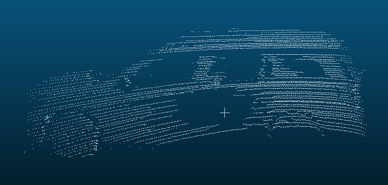
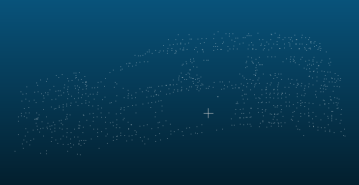
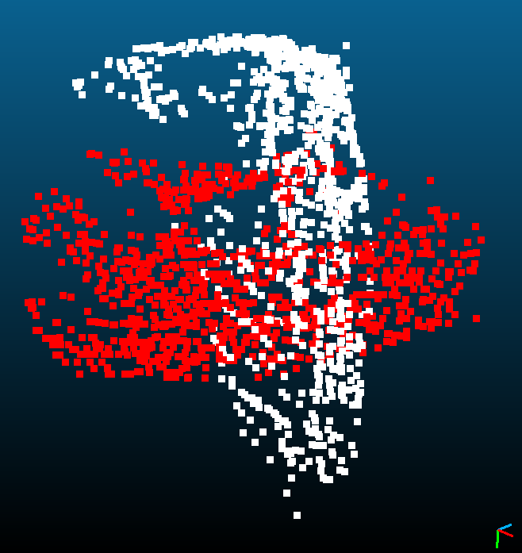
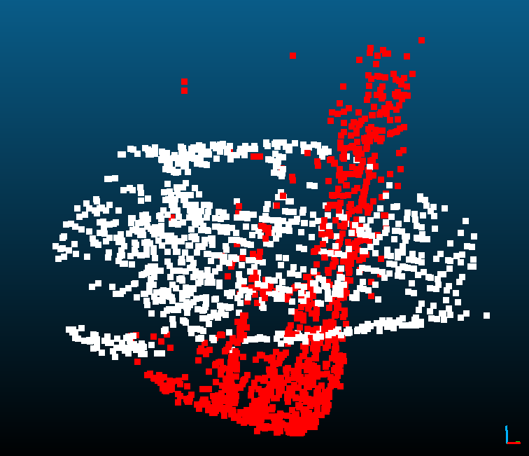
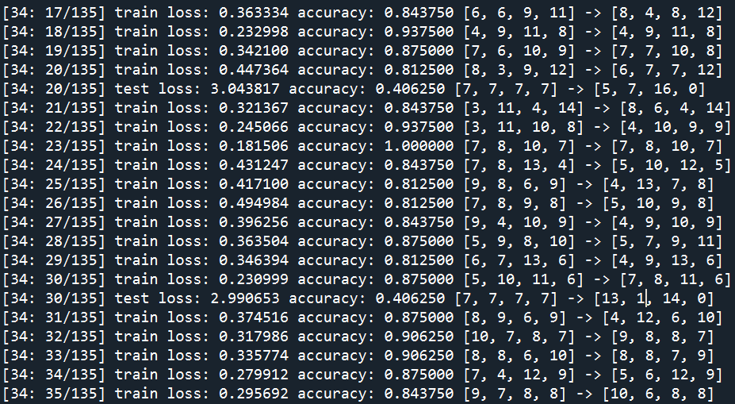
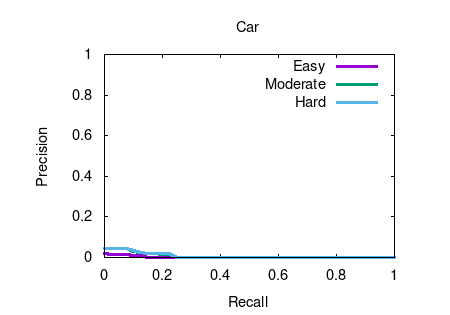
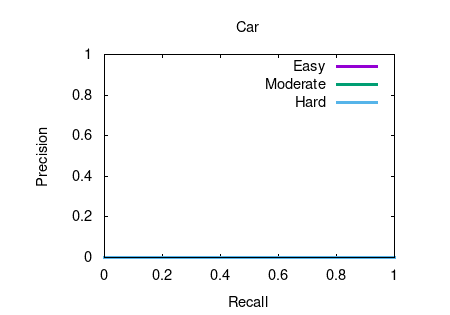

# HW10

# 整体流程

## 训练

- 获取点云分类数据集
- data transformation
- 训练PointNet或PointNet++

## 测试

- 移除地面
- 聚类
- 忽略太小或太大的点云
- 送进神经网络里进行推论
- 将PointNet的输出转成kitti的格式

# 获取点云分类数据集

跟第六次作业一样，本次作业仍是在[sshaoshuai/PointRCNN](https://github.com/sshaoshuai/PointRCNN)这个开源项目的基础上进行的。

## 读取点云及标签

从点云中框出物体的代码是参考自[Visualization issue](https://github.com/sshaoshuai/PointRCNN/issues/148)，在这个issue当中，他做了很好的可视化，便于及时查看效果。但正如issue里所提到的，画出来的框都在很奇怪的位置。关于这一点，在读了跟数据载入相关的代码后，终于找到了解决方案。

在`kitti_rcnn_dataset.py`里有：

```python
calib = self.get_calib(sample_id)
img_shape = self.get_image_shape(sample_id)
pts_lidar = self.get_lidar(sample_id)
pts_rect = calib.lidar_to_rect(pts_lidar[:, 0:3])
pts_intensity = pts_lidar[:, 3]
```

可以看到它不止读取了点云，还读取了calibration file，然后调用`calib.lidar_to_rect`对进行点云做校正。

最后写出了以下读取点云的代码：

```python
calib = get_calib(calib_dir, sample_id)
pts_lidar = get_lidar(cloud_dir, sample_id)
pts_rect = calib.lidar_to_rect(pts_lidar[:, 0:3])
```

其中`get_calib`,`get_lidar`及`lidar_to_rect`是对项目里的函数稍加修改而来的。

接着是读取标签，参考`kitti_rcnn_dataset.py`的`get_proposal_from_file`函数：

```python
gt_obj_list = self.filtrate_objects(self.get_label(sample_id))
gt_boxes3d = kitti_utils.objs_to_boxes3d(gt_obj_list)
gt_corners = kitti_utils.boxes3d_to_corners3d(gt_boxes3d)
```

改写成：

```python
gt_obj_list = filtrate_objects(classes, get_label(label_dir, sample_id))
boxes3d = objs_to_boxes3d(gt_obj_list)
corners3d = boxes3d_to_corners3d(boxes3d)
```

## 获取物体点云

得到校正过的点云及标签后，接下来是实际把点云中被框住的点取出来，作为等会训练PointNet的样本。因此我们需要一个能快速分辨哪些点落在长方体内算法。在这一步我做了两种尝试。

第一个方法参考自[Finding if point is in 3D poly in python](https://stackoverflow.com/questions/29311682/finding-if-point-is-in-3d-poly-in-python)，是在三维空间找出`corners3d`的ConvexHull，然后对点云中的每个点，都将它加入ConvexHull试试，如果ConvexHull没有改变，就说明该点落在该ConvexHull内：

```python
def pnt_in_cvex_hull_1(hull, pnt):
    new_hull = ConvexHull(np.concatenate((hull.points, [pnt])))
    if np.array_equal(new_hull.vertices, hull.vertices): 
        return True
    return False

hull = ConvexHull(corner3d, incremental=True)
in_hull = np.zeros(pts_rect.shape[0], dtype=bool)
for i, pt in tqdm(enumerate(pts_rect)):
    in_hull[i] = pnt_in_cvex_hull_1(hull, pt)
```

其中`in_hull`代表点云中落在长方体内的点的索引。

但是这种做法速度太慢，所以后来采用第二种方法。

因为直接在三维空间中做运算速度太慢，所以我想到了第二种做法：先将点云及`corners3d`投影到水平面上，然后判断每个点是否落在长方形内，对于落在长方形内的点，再判断它们在高度方向上是否满足要求。其中"判断每个点是否落在长方形内"的代码是参考自[How to get list of points inside a polygon in python?](https://stackoverflow.com/questions/21339448/how-to-get-list-of-points-inside-a-polygon-in-python)。

```python
corner2d = corner3d[:,[0,2]]
corner2d = corner2d[:4]
ymin = corner3d[:,1].min()
ymax = corner3d[:,1].max()
p = Path(corner2d) # make a polygon
in_rect_2d = p.contains_points(pts_rect[:,[0,2]])
in_hull = np.logical_and(in_rect_2d, pts_rect[:,1]>=ymin)
in_hull = np.logical_and(in_hull, pts_rect[:,1]<=ymax)
```

这里踩了个坑：一开始被x,y,z的名称给迷惑住，以为z代表高度方向。后来将点云可视化后才发现原来代表高度方向的是y。

其实在`kitti_rcnn_dataset.py`的`get_rcnn_sample_info`函数中已经有实现了？

## normalize

（后来没有用这个方法，而是将normalize的步骤写在`torchvision.transforms`内，动态地做normalize）

丢进神经网络前先normalize，即减去平均值后，将最长的边缩放到[-0.5,0.5]之间。

```python
lower = np.min(cloud, axis=0)
upper = np.max(cloud, axis=0)
center = (lower+upper)/2.0
# move to (0,0,0)
cloud = cloud - center
# resize to (-0.5, 0.5)
ratio = 1.0/(upper - lower).max()
cloud = cloud * ratio
```


## resample

（后来没有用这个方法，而是将resample的步骤写在`torchvision.transforms`内，动态地做Input Dropout）

在第五次作业中，我们对`modelnet40_normal_resampled`这个数据集进行分类。有一点值得注意的是，该数据集内每个sample的点数皆为10000，因此不需要做太多前处理就能送进神经网络。

而这次作业的数据集是自己准备的，各点云大小不一，得先进行resample，确保个点云大小一致，才能送进PointNet。

将目标点数设为1000个点。

resample时用到的pcl python wrapper是[strawlab/python-pcl](https://github.com/strawlab/python-pcl)，本来想对点数少于1000的点云做上采样，但是发现python版本的`MovingLeastSquares`没有`setUpsamplingMethod`方法，因此作罢。仅对点数超过1000的点云进行下采样。

下采样使用`VoxelGrid`：

```python
def downsampleCloud(cloud, leaf_size):
    vg = cloud.make_voxel_grid_filter()
    vg.set_leaf_size(leaf_size, leaf_size, leaf_size)
    cloud_filtered = vg.filter()
    return cloud_filtered
```

但是上述方法无法保证得到点云的点数都是1000，因此还需要多做一步：

```python
def downsample(arr, tgt_size, leaf_size):
    if arr.shape[0] >= tgt_size*1.5:
        if arr.shape[0] <= tgt_size*3:
            leaf_size = 0.02
        else:
            leaf_size = 0.05
        
        cloud = pcl.PointCloud()
        cloud.from_array(arr)
        
        cloud_down = downsampleCloud(cloud, leaf_size)
        
        if cloud_down.size >= tgt_size:
            arr_down = cloud_down.to_array()
            
        # print(arr.shape[0],"->",arr_down.shape[0])
    
    arr_final = arr[np.random.choice(arr.shape[0], tgt_size, replace=False), :]
    
    return arr_final
```





## 切分train/val

首先选取点数超过1000的点云，然后再用约为8：2的比例切成train/val。

```python
val_size = int(min(map(len, class2samples.values())) * 0.2)

for _class in range(4):
    print("class", _class)
    samples = class2samples[_class]
    full_size = len(samples)
    
    train_size = full_size - val_size
    
    random.shuffle(samples)
    
    samples = ["data_object_box/"+sample[:-4]+"\n" for sample in samples]
    
    with open("kitti_train.txt", "a") as f:
        f.writelines(samples[:train_size])
    
    with open("kitti_val.txt", "a") as f:
        f.writelines(samples[train_size:])
```

先算出各个类别的样本数，然后把最小类别的数量乘上0.2当作之后验证集各类别要有的样本数，即`val_size`，这样做的目的是希望验证集是均衡的。接着遍历各类别，将每个类别切成训练验证两部分，然后写入`kitti_train.txt`及`kitti_val.txt`。

训练集里4个类别的数量，分别是：Others:336, Vehicle:3919, Pedestrian:32, Cyclist:40。验证集里4个类别的数量都是7。

# 训练分类模型

## 坐标系转换

因为KITTI数据集的高度方向是y，而我们惯用的高度方向为z，所以在输入神经网络前得将点云转成以z轴为高度方向。

```python
class RotateFromY(object):
    def __init__(self):
        pass

    def __call__(self, sample):
        cloud, _class = sample['cloud'], sample['class']
        cloud[:,1], cloud[:,2] = cloud[:,2], -cloud[:,1]
        return {'cloud': cloud, 'class': _class}
```





## 数据增强 - 切除下半部

做了测试之后发现，地面移除算法的效果并不是完美的，它时常常会把人或车的下半部给一并截掉。为了让模型能适应这种情况，所以才做这项处理。

```python
class RandomCrop(object):
    """
    RandomCrop
    """

    def __init__(self, maxratio = 0.5, ts = 1000):
        self.maxratio_ = maxratio
        self.ts_ = ts

    def __call__(self, sample):
        cloud, _class, _id = sample['cloud'], sample['class'], sample['id']
        zmax = np.max(cloud,axis=0)[2]
        zmin = np.min(cloud,axis=0)[2]
        zrange = zmax-zmin
        ratio = np.random.uniform(0, self.maxratio_)
        newzmin = zmin + zrange*ratio
        cloud_crop, cloud_remain = cloud[cloud[:,2]>=newzmin,:], cloud[cloud[:,2]<newzmin,:]
        if cloud_crop.shape[0] < self.ts_:
          cloud_remain = cloud_remain[np.random.choice(cloud_remain.shape[0], self.ts_-cloud_crop.shape[0], replace=False), :]
          cloud_crop = np.vstack([cloud_crop, cloud_remain])
        return {'cloud': cloud_crop, 'class': _class, 'id': _id}
```

参数`maxratio`表示要截去的比例，`ts`表示输出的点数不能低于这个数字。如果crop之后点数少于`ts`，则要从被截掉的部分拿点来补齐。

注意这里是把z当成高度方向，所以这一步要在“坐标系转换”之后做。

## 数据增强 - Input Dropout

随机从输入里丢弃点，只保留`ts`个点。

```python
class InputDropout(object):
    """
    InputDropout
    """

    def __init__(self, ts = 1000):
        self.ts_ = ts

    def __call__(self, sample):
        cloud, _class, _id = sample['cloud'], sample['class'], sample['id']
        cloud = cloud[np.random.choice(cloud.shape[0], self.ts_, replace=False), :]
        return {'cloud': cloud, 'class': _class, 'id': _id}
```

目前只能让网络接受相同大小的输入。较理想的做法是每个batch都用不一样的输入大小，让网络更加robust。可能的做法参考：

[How to create a dataloader with variable-size input](https://discuss.pytorch.org/t/how-to-create-a-dataloader-with-variable-size-input/8278)

## Normalize

在丢入神经网络前做normalize。

```python
class Normalize(object):
    """
    normalize to [-0.5, 0.5]
    """

    def __init__(self):
        pass

    def __call__(self, sample):
        cloud, _class, _id = sample['cloud'], sample['class'], sample['id']
        cloud = np.reshape(cloud, (-1,3))
        lower = np.min(cloud, axis=0)
        upper = np.max(cloud, axis=0)
        center = (lower+upper)/2.0
        # move to (0,0,0)
        cloud = cloud - center
        # resize to (-0.5, 0.5)
        ratio = 1.0/(upper - lower).max()
        cloud = cloud * ratio
        return {'cloud': cloud, 'class': _class, 'id': _id}
```

## 数据增强 - 沿z轴旋转

基于作业五。旋转角度范围设为`[-PI,PI]`。

```python
class RandomRotateOverZ(object):
    def __init__(self):
        theta = np.random.uniform(-np.pi,np.pi)
        ux, uy, uz = 0, 0, 1
        cost = np.cos(theta)
        sint = np.sin(theta)
        #https://en.wikipedia.org/wiki/Rotation_matrix#Rotation_matrix_from_axis_and_angle
        self.rot_mat = np.matrix([
          [cost+ux*ux*(1-cost),  ux*uy*(1-cost)-uz*sint, ux*uz*(1-cost)+uy*sint],
          [uy*ux*(1-cost)+uz*sint, cost+uy*uy*(1-cost),  uy*uz*(1-cost)-ux*sint],
          [uz*ux*(1-cost)-uy*sint, uz*uy*(1-cost)+ux*sint, cost+uz*uz*(1-cost)]])

    def __call__(self, sample):
        cloud, _class, _id = sample['cloud'], sample['class'], sample['id']
        cloud = np.matmul(self.rot_mat, cloud.T)
        cloud = cloud.T
        return {'cloud': cloud, 'class': _class, 'id': _id}
```


## 数据增强 - 高斯噪声

使用`np.random.normal`为点云添加高斯噪声，幅度为`amp`。

```python
class AddGaussianNoise(object):
    def __init__(self, amp = 0.1):
        self.amp_ = amp

    def __call__(self, sample):
        cloud, _class, _id = sample['cloud'], sample['class'], sample['id']
        cloud = cloud + np.random.normal(loc=0,scale=self.amp_,size=cloud.shape)
        return {'cloud': cloud, 'class': _class, 'id': _id}
```

## 处理类别不均衡问题

统计训练集里4个类别的数量，分别是：Others:336, Vehicle:3919, Pedestrian:32, Cyclist:40，类别严重不均衡。

为了处理类别不均衡的问题，参考[Balanced Sampling between classes with torchvision DataLoader](https://discuss.pytorch.org/t/balanced-sampling-between-classes-with-torchvision-dataloader/2703/3)，为每一个sample计算它应有的weight，然后在使用`torch.utils.data.DataLoader`时指定`sampler`参数。

```python
def make_weights_for_balanced_classes(classes, nclasses):
    count = [0] * nclasses
    for _class in classes:
        count[_class] += 1
    weight_per_class = [0.] * nclasses
    N = float(sum(count))
    for i in range(nclasses):
        weight_per_class[i] = N/float(count[i])
    weight = [0] * len(classes)
    for idx, _class in enumerate(classes):
        weight[idx] = weight_per_class[_class]
    return weight

weights = make_weights_for_balanced_classes(train_dataset.classes, 
                                                len(train_dataset.classnames))
weights = torch.FloatTensor(weights)
sampler = torch.utils.data.sampler.WeightedRandomSampler(weights, len(weights))

train_loader = torch.utils.data.DataLoader(
    train_dataset, batch_size=batch_size, num_workers=nworkers,    
    sampler = sampler, pin_memory=True)
```

## 网络架构

相较于modelnet40，本次的数据集只有4个类别，应该算是简单的任务。另外因为数量最少的类别只有32笔训练数据，如果使用原版的PointNet将很容易造成过拟合。因此我将PointNet的层数及减少如下。

```python
class PointNetSmall(nn.Module):
    def __init__(self, k, pool_size=10000, dropout_rate = 0):
        super(PointNetSmall, self).__init__()
        self.k_ = k
        self.dropout_rate_ = dropout_rate
        self.linear2_1 = nn.Conv1d(3, 2, 1)
        self.bn1 = nn.BatchNorm1d(2)
        self.pool = nn.MaxPool1d(pool_size)
        self.linear2_2 = nn.Linear(2, 2)
        self.bn2 = nn.BatchNorm1d(2)
        self.dropout1 = nn.Dropout(p=self.dropout_rate_)
        self.linear2_3 = nn.Linear(2, 2)
        self.bn3 = nn.BatchNorm1d(2)
        self.lineark = nn.Linear(2, self.k_)
        
        
    
    def forward(self, x):
        #ignore input transform
        x = x.transpose(1, 2)
        x = torch.nn.ReLU()(self.bn1(self.linear2_1(x)))
        x = x.transpose(1, 2)
        x = self.pool(x.permute(0,2,1)).permute(0,2,1)
        x = torch.squeeze(x, 1)
        if self.dropout_rate_ > 0:
          x = torch.nn.ReLU()(self.bn2(self.dropout1(self.linear2_2(x))))
        else:
          x = torch.nn.ReLU()(self.bn2(self.linear2_2(x)))
        x = torch.nn.ReLU()(self.bn3(self.linear2_3(x)))
        x = F.log_softmax(self.lineark(x), dim=1)
        return x
```

## 迁移学习

### meder411/PointNet-PyTorch

拿自己建的网络做了许多尝试还是得不到好的结果，所以后来改用迁移学习的方法。网上找不到人车的分类模型，最接近的只有[meder411/PointNet-PyTorch](https://github.com/meder411/PointNet-PyTorch)所提供的pretrained的modelnet40模型。

但是该项目是基于Python2，并且只接受off格式的输入，因此还没来得及尝试。

### fxia22/pointnet.pytorch

我自己的改过的版本[keineahnung2345/pointnet.pytorch](https://github.com/keineahnung2345/pointnet.pytorch/tree/modelnet40_normalize_resampled)，能接受modelnet40。

使用modelnet40数据集来预先训练模型。

```
Namespace(batchSize=32, dataset='../../modelnet40_normal_resampled', dataset_type='modelnet40', model='../../drive/MyDrive/fxia22_modelnet40/cls_model_9.pth', num_points=2500)
{'airplane': 0, 'bathtub': 1, 'bed': 2, 'bench': 3, 'bookshelf': 4, 'bottle': 5, 'bowl': 6, 'car': 7, 'chair': 8, 'cone': 9, 'cup': 10, 'curtain': 11, 'desk': 12, 'door': 13, 'dresser': 14, 'flower_pot': 15, 'glass_box': 16, 'guitar': 17, 'keyboard': 18, 'lamp': 19, 'laptop': 20, 'mantel': 21, 'monitor': 22, 'night_stand': 23, 'person': 24, 'piano': 25, 'plant': 26, 'radio': 27, 'range_hood': 28, 'sink': 29, 'sofa': 30, 'stairs': 31, 'stool': 32, 'table': 33, 'tent': 34, 'toilet': 35, 'tv_stand': 36, 'vase': 37, 'wardrobe': 38, 'xbox': 39}
i:0  loss: 0.722475 accuracy: 0.843750
i:1  loss: 0.532979 accuracy: 0.875000
i:2  loss: 1.197041 accuracy: 0.656250
i:3  loss: 0.610503 accuracy: 0.812500
i:4  loss: 0.478687 accuracy: 0.812500
i:5  loss: 0.864186 accuracy: 0.750000
i:6  loss: 1.012906 accuracy: 0.750000
i:7  loss: 0.476598 accuracy: 0.875000
i:8  loss: 0.557232 accuracy: 0.875000
i:9  loss: 0.506859 accuracy: 0.843750
i:10  loss: 1.384401 accuracy: 0.593750
i:11  loss: 0.587875 accuracy: 0.812500
i:12  loss: 0.931772 accuracy: 0.718750
i:13  loss: 1.031950 accuracy: 0.750000
i:14  loss: 1.388869 accuracy: 0.625000
i:15  loss: 0.698315 accuracy: 0.718750
i:16  loss: 0.598772 accuracy: 0.781250
i:17  loss: 0.630447 accuracy: 0.812500
i:18  loss: 0.586418 accuracy: 0.843750
i:19  loss: 0.934312 accuracy: 0.718750
i:20  loss: 0.566421 accuracy: 0.843750
i:21  loss: 0.848789 accuracy: 0.812500
i:22  loss: 0.245791 accuracy: 0.906250
i:23  loss: 0.529820 accuracy: 0.875000
i:24  loss: 0.614451 accuracy: 0.781250
i:25  loss: 0.695201 accuracy: 0.781250
i:26  loss: 0.439851 accuracy: 0.843750
i:27  loss: 1.171184 accuracy: 0.718750
i:28  loss: 0.582757 accuracy: 0.781250
i:29  loss: 0.989368 accuracy: 0.781250
i:30  loss: 0.722244 accuracy: 0.812500
i:31  loss: 0.752772 accuracy: 0.750000
i:32  loss: 1.004827 accuracy: 0.750000
i:33  loss: 1.042548 accuracy: 0.625000
i:34  loss: 0.904270 accuracy: 0.750000
i:35  loss: 0.983585 accuracy: 0.718750
i:36  loss: 0.263956 accuracy: 0.937500
i:37  loss: 1.329470 accuracy: 0.656250
i:38  loss: 0.729401 accuracy: 0.781250
i:39  loss: 0.658662 accuracy: 0.750000
i:40  loss: 0.716225 accuracy: 0.843750
i:41  loss: 0.723203 accuracy: 0.718750
i:42  loss: 1.008381 accuracy: 0.750000
i:43  loss: 0.882320 accuracy: 0.781250
i:44  loss: 0.578837 accuracy: 0.875000
i:45  loss: 0.615451 accuracy: 0.781250
i:46  loss: 0.699543 accuracy: 0.812500
i:47  loss: 1.042476 accuracy: 0.718750
i:48  loss: 1.045246 accuracy: 0.718750
i:49  loss: 0.558945 accuracy: 0.812500
i:50  loss: 1.150513 accuracy: 0.750000
i:51  loss: 0.466744 accuracy: 0.750000
i:52  loss: 1.187163 accuracy: 0.718750
i:53  loss: 0.982331 accuracy: 0.781250
i:54  loss: 0.676720 accuracy: 0.843750
i:55  loss: 1.350997 accuracy: 0.625000
i:56  loss: 0.865414 accuracy: 0.781250
i:57  loss: 1.495847 accuracy: 0.531250
i:58  loss: 0.677517 accuracy: 0.750000
i:59  loss: 0.425703 accuracy: 0.875000
i:60  loss: 0.964372 accuracy: 0.812500
i:61  loss: 1.499626 accuracy: 0.625000
i:62  loss: 0.331669 accuracy: 0.906250
i:63  loss: 0.770170 accuracy: 0.781250
i:64  loss: 0.690494 accuracy: 0.812500
i:65  loss: 0.611742 accuracy: 0.812500
i:66  loss: 0.364463 accuracy: 0.937500
i:67  loss: 0.851093 accuracy: 0.781250
i:68  loss: 0.426605 accuracy: 0.812500
i:69  loss: 0.801321 accuracy: 0.781250
i:70  loss: 1.547083 accuracy: 0.750000
i:71  loss: 0.835978 accuracy: 0.812500
i:72  loss: 0.578036 accuracy: 0.812500
i:73  loss: 0.809206 accuracy: 0.656250
i:74  loss: 1.042363 accuracy: 0.750000
i:75  loss: 0.432178 accuracy: 0.875000
i:76  loss: 0.487327 accuracy: 0.875000
i:77  loss: 0.315604 accuracy: 0.125000
2468 78
Total accuracy: 0.778768
```

先建立k分类的模型，然后载入已训练的权重。因为有些层的维度已经改变，所以在载入时要检查相对应的层之间的形状是否一致。载入预训练的权重后，还要固定特征抽取module的权重。

```python
pn = PointNetCls(k=len(train_dataset.classnames), feature_transform=False)
pretrained_dict = torch.load("cls_model_9.pth", map_location=device)
model_dict = pn.state_dict()

# 1. filter out unnecessary keys
pretrained_dict = {k: v for k, v in pretrained_dict.items() \
                   if k in model_dict and \
                       model_dict[k].shape == pretrained_dict[k].shape}
# 2. overwrite entries in the existing state dict
model_dict.update(pretrained_dict) 
# 3. load the new state dict
pn.load_state_dict(model_dict)

for name, param in pn.named_parameters():
    if "feat" in name:
        param.requires_grad = False
```

因为`fxia22/pointnet.pytorch`的输出入格式与之前用的不太一样，所以还需做以下调整：

```python
#points = data['cloud'].float().to(device)
#target = data['class'].to(device)           
points = points.permute(0,2,1)
pred = pn(points)
pred = pred[0]
```

迁移学习log：

```
device cpu
train_dataset.classes 4327 [0, 0, 0, 0, 0]
classnames ['Other', 'Vehicle', 'Pedestrian', 'Cyclist']
count of different classes [336, 3919, 32, 40]
[0: 0/135] train loss: 1.603803 accuracy: 0.187500 [8, 7, 11, 6] -> [17, 1, 3, 11]
[0: 0/135] test loss: 1.604945 accuracy: 0.218750 [7, 7, 7, 7] -> [19, 0, 0, 9]
[0: 1/135] train loss: 1.472777 accuracy: 0.250000 [12, 7, 4, 9] -> [15, 1, 8, 8]
[0: 2/135] train loss: 1.600385 accuracy: 0.218750 [8, 12, 3, 9] -> [14, 0, 8, 10]
[0: 3/135] train loss: 1.534911 accuracy: 0.187500 [6, 4, 11, 11] -> [20, 0, 6, 6]
[0: 4/135] train loss: 1.319167 accuracy: 0.281250 [13, 4, 9, 6] -> [15, 3, 4, 10]
[0: 5/135] train loss: 1.450791 accuracy: 0.187500 [5, 10, 8, 9] -> [15, 1, 6, 10]
[0: 6/135] train loss: 1.468596 accuracy: 0.250000 [14, 3, 12, 3] -> [16, 1, 6, 9]
[0: 7/135] train loss: 1.446518 accuracy: 0.250000 [7, 8, 13, 4] -> [18, 0, 5, 9]
[0: 8/135] train loss: 1.519558 accuracy: 0.187500 [9, 12, 5, 6] -> [19, 0, 4, 9]
[0: 9/135] train loss: 1.374694 accuracy: 0.312500 [10, 7, 6, 9] -> [16, 1, 7, 8]
[0: 10/135] train loss: 1.281148 accuracy: 0.437500 [11, 7, 5, 9] -> [12, 3, 10, 7]
[0: 10/135] test loss: 1.732095 accuracy: 0.343750 [7, 7, 7, 7] -> [12, 0, 0, 16]
[0: 11/135] train loss: 1.507650 accuracy: 0.281250 [7, 8, 8, 9] -> [15, 1, 6, 10]
[0: 12/135] train loss: 1.512036 accuracy: 0.375000 [8, 4, 6, 14] -> [14, 1, 8, 9]
[0: 13/135] train loss: 1.439054 accuracy: 0.343750 [9, 5, 8, 10] -> [11, 2, 10, 9]
[0: 14/135] train loss: 1.398593 accuracy: 0.281250 [10, 11, 3, 8] -> [13, 1, 10, 8]
[0: 15/135] train loss: 1.449659 accuracy: 0.156250 [5, 7, 9, 11] -> [14, 2, 8, 8]
[0: 16/135] train loss: 1.454407 accuracy: 0.187500 [6, 9, 10, 7] -> [15, 0, 6, 11]
[0: 17/135] train loss: 1.427391 accuracy: 0.156250 [5, 7, 10, 10] -> [16, 1, 10, 5]
[0: 18/135] train loss: 1.442687 accuracy: 0.250000 [6, 13, 6, 7] -> [18, 0, 5, 9]
[0: 19/135] train loss: 1.458491 accuracy: 0.156250 [7, 10, 4, 11] -> [15, 2, 6, 9]
[0: 20/135] train loss: 1.343427 accuracy: 0.437500 [10, 5, 12, 5] -> [17, 4, 3, 8]
[0: 20/135] test loss: 1.950000 accuracy: 0.437500 [7, 7, 7, 7] -> [13, 0, 2, 13]
[0: 21/135] train loss: 1.308163 accuracy: 0.375000 [5, 11, 10, 6] -> [14, 0, 9, 9]
[0: 22/135] train loss: 1.298344 accuracy: 0.375000 [9, 9, 8, 6] -> [17, 1, 6, 8]
[0: 23/135] train loss: 1.358046 accuracy: 0.375000 [7, 10, 6, 9] -> [14, 4, 6, 8]
[0: 24/135] train loss: 1.333810 accuracy: 0.375000 [13, 9, 1, 9] -> [16, 2, 5, 9]
[0: 25/135] train loss: 1.284704 accuracy: 0.500000 [11, 6, 6, 9] -> [13, 2, 9, 8]
[0: 26/135] train loss: 1.290880 accuracy: 0.343750 [9, 9, 8, 6] -> [8, 5, 8, 11]
[0: 27/135] train loss: 1.212772 accuracy: 0.468750 [10, 6, 5, 11] -> [13, 2, 8, 9]
[0: 28/135] train loss: 1.267475 accuracy: 0.437500 [13, 5, 6, 8] -> [9, 3, 8, 12]
[0: 29/135] train loss: 1.300162 accuracy: 0.343750 [6, 6, 9, 11] -> [16, 1, 4, 11]
[0: 30/135] train loss: 1.239832 accuracy: 0.406250 [6, 5, 9, 12] -> [13, 3, 5, 11]
[0: 30/135] test loss: 2.029940 accuracy: 0.437500 [7, 7, 7, 7] -> [15, 0, 2, 11]
[0: 31/135] train loss: 1.243284 accuracy: 0.468750 [10, 6, 6, 10] -> [14, 2, 6, 10]
[0: 32/135] train loss: 1.435626 accuracy: 0.250000 [4, 13, 8, 7] -> [12, 4, 8, 8]
[0: 33/135] train loss: 1.233376 accuracy: 0.406250 [7, 5, 8, 12] -> [13, 3, 5, 11]
[0: 34/135] train loss: 1.207726 accuracy: 0.531250 [8, 9, 8, 7] -> [15, 2, 8, 7]
[0: 35/135] train loss: 1.193360 accuracy: 0.531250 [7, 7, 7, 11] -> [13, 1, 7, 11]
[0: 36/135] train loss: 1.269686 accuracy: 0.437500 [10, 7, 6, 9] -> [11, 4, 9, 8]
[0: 37/135] train loss: 1.306830 accuracy: 0.343750 [5, 9, 12, 6] -> [12, 2, 7, 11]
[0: 38/135] train loss: 1.332281 accuracy: 0.343750 [13, 9, 4, 6] -> [10, 3, 6, 13]
[0: 39/135] train loss: 1.242082 accuracy: 0.468750 [11, 8, 4, 9] -> [12, 1, 10, 9]
[0: 40/135] train loss: 1.227945 accuracy: 0.375000 [8, 6, 8, 10] -> [15, 0, 7, 10]
[0: 40/135] test loss: 2.166709 accuracy: 0.375000 [7, 7, 7, 7] -> [16, 0, 2, 10]
[0: 41/135] train loss: 1.186524 accuracy: 0.593750 [10, 8, 8, 6] -> [11, 4, 9, 8]
[0: 42/135] train loss: 1.205421 accuracy: 0.468750 [8, 8, 8, 8] -> [12, 3, 8, 9]
[0: 43/135] train loss: 1.233342 accuracy: 0.375000 [4, 9, 9, 10] -> [9, 2, 13, 8]
[0: 44/135] train loss: 1.192333 accuracy: 0.468750 [7, 6, 7, 12] -> [10, 5, 6, 11]
[0: 45/135] train loss: 1.012240 accuracy: 0.687500 [12, 5, 8, 7] -> [13, 4, 8, 7]
[0: 46/135] train loss: 1.344542 accuracy: 0.343750 [6, 12, 6, 8] -> [8, 6, 8, 10]
[0: 47/135] train loss: 1.177613 accuracy: 0.500000 [7, 5, 11, 9] -> [11, 2, 9, 10]
[0: 48/135] train loss: 1.104319 accuracy: 0.531250 [8, 2, 10, 12] -> [13, 5, 8, 6]
[0: 49/135] train loss: 1.212985 accuracy: 0.406250 [8, 8, 8, 8] -> [10, 2, 10, 10]
[0: 50/135] train loss: 1.151078 accuracy: 0.656250 [10, 5, 12, 5] -> [14, 1, 8, 9]
[0: 50/135] test loss: 2.162142 accuracy: 0.281250 [7, 7, 7, 7] -> [23, 0, 4, 1]
[0: 51/135] train loss: 1.182673 accuracy: 0.562500 [8, 3, 8, 13] -> [11, 3, 9, 9]
[0: 52/135] train loss: 1.211776 accuracy: 0.500000 [6, 13, 7, 6] -> [14, 3, 9, 6]
[0: 53/135] train loss: 1.217816 accuracy: 0.468750 [8, 7, 8, 9] -> [12, 2, 8, 10]
[0: 54/135] train loss: 1.205060 accuracy: 0.406250 [7, 7, 9, 9] -> [14, 4, 7, 7]
[0: 55/135] train loss: 1.215259 accuracy: 0.500000 [10, 8, 9, 5] -> [8, 5, 10, 9]
[0: 56/135] train loss: 1.143102 accuracy: 0.500000 [9, 7, 7, 9] -> [14, 2, 6, 10]
[0: 57/135] train loss: 1.178703 accuracy: 0.531250 [6, 11, 8, 7] -> [11, 4, 8, 9]
[0: 58/135] train loss: 1.262509 accuracy: 0.343750 [8, 15, 4, 5] -> [10, 1, 11, 10]
[0: 59/135] train loss: 1.092053 accuracy: 0.531250 [9, 5, 9, 9] -> [10, 5, 8, 9]
[0: 60/135] train loss: 1.149822 accuracy: 0.500000 [6, 8, 8, 10] -> [11, 4, 8, 9]
[0: 60/135] test loss: 2.144820 accuracy: 0.250000 [7, 7, 7, 7] -> [24, 0, 4, 0]
[0: 61/135] train loss: 1.210756 accuracy: 0.468750 [6, 7, 12, 7] -> [11, 7, 5, 9]
[0: 62/135] train loss: 1.196920 accuracy: 0.531250 [9, 12, 6, 5] -> [13, 3, 6, 10]
[0: 63/135] train loss: 1.170317 accuracy: 0.406250 [8, 6, 11, 7] -> [8, 6, 8, 10]
[0: 64/135] train loss: 1.075103 accuracy: 0.593750 [8, 9, 9, 6] -> [13, 2, 8, 9]
[0: 65/135] train loss: 1.120183 accuracy: 0.500000 [6, 10, 9, 7] -> [7, 3, 15, 7]
[0: 66/135] train loss: 1.108047 accuracy: 0.406250 [4, 12, 8, 8] -> [12, 3, 7, 10]
[0: 67/135] train loss: 1.200622 accuracy: 0.562500 [9, 13, 6, 4] -> [9, 7, 9, 7]
[0: 68/135] train loss: 1.089845 accuracy: 0.625000 [8, 9, 6, 9] -> [11, 4, 7, 10]
[0: 69/135] train loss: 1.074352 accuracy: 0.656250 [6, 8, 11, 7] -> [5, 6, 11, 10]
[0: 70/135] train loss: 1.131416 accuracy: 0.500000 [8, 12, 5, 7] -> [11, 4, 7, 10]
[0: 70/135] test loss: 2.230565 accuracy: 0.250000 [7, 7, 7, 7] -> [25, 0, 3, 0]
[0: 71/135] train loss: 0.924507 accuracy: 0.750000 [5, 11, 8, 8] -> [10, 5, 9, 8]
[0: 72/135] train loss: 0.961579 accuracy: 0.687500 [9, 7, 7, 9] -> [8, 5, 8, 11]
[0: 73/135] train loss: 0.990821 accuracy: 0.718750 [7, 10, 8, 7] -> [6, 6, 10, 10]
[0: 74/135] train loss: 1.159029 accuracy: 0.468750 [6, 11, 10, 5] -> [6, 4, 13, 9]
[0: 75/135] train loss: 1.154577 accuracy: 0.562500 [8, 11, 3, 10] -> [9, 7, 6, 10]
[0: 76/135] train loss: 1.188609 accuracy: 0.500000 [10, 7, 5, 10] -> [6, 5, 10, 11]
```

## 训练SVM

可参考[基于SVM的三维点云分类（建筑，树木）](http://www.yhqiao.xyz/index.php/2020/03/26/svm/)

# 测试

## 移除地面

同作业四

## 聚类

同作业四

## 忽略太小或太大的点云

忽略点数少于1000的点云。

长宽高上限皆设为3米。

```python
def check_valid(cloud):
    if cloud.shape[0] < cloud_size_thres:
        return False
    extent = np.max(cloud,axis=0)-np.min(cloud,axis=0)
    if np.max(extent) > 3:
        return False
    return True
```

## 送进神经网络里进行推论

推论一笔数据的函数如下，回传所属类别及分数：

```python
def evaluate_one(pn, cloud, device=torch.device('cpu')):
    sample = {'cloud': cloud, 'class': -1, 'id': -1}
    transform = torchvision.transforms.Compose([
        # InputDropout(),
        Normalize(),
        RotateFromY(),
        # ToTensor()
        ])
    sample = transform(sample)
    points = sample["cloud"][np.newaxis,...]
    points = torch.from_numpy(points)
    points = points.float().to(device)
    with torch.no_grad():
        pred = pn(points)
    pred = pred.cpu().detach().numpy()[0] #batch size is 1
    pred_choice = np.argmax(pred)
    # because we are using np.log_softmax in PointNet
    # so here we need to use np.exp to convert it back to score
    score = np.exp(pred[pred_choice])
    # class, score
    return pred_choice, score
```

注意因为在模型里面是使用`F.log_softmax`作为激活函数，所以这里得在神经网络的输出加上`np.exp`，将它转回概率值。

调用`evaluate_one`函数：

```python
pn.pool = nn.MaxPool1d(pts_lidar.shape[0])
classid, score = evaluate_one(pn, pts_lidar)
```

在测试时，可以动态地依照点云大小来设定pool层的kernel size，因此在将点云输入神经网络时，就不需要做`InputDropout`这个transform。

## 将PointNet的输出转成kitti的格式

参考[sshaoshuai/PointRCNN/blob/master/tools/eval_rcnn.py](https://github.com/sshaoshuai/PointRCNN/blob/master/tools/eval_rcnn.py)里的写法，它将一个大点云里检测出来的多个物体收集到一个N*7的numpy array里；将分数则收集到一个长度为N的numpy array里，然后调用`save_kittti_format`函数。

这里如法炮制，需要将检测到的物体的类别，分数及bounding box传入（改写过的）`save_kitti_format`。

```python
def save_kitti_format(classes, sample_id, calib, bbox3d, kitti_output_dir, scores, img_shape):
    corners3d = boxes3d_to_corners3d(bbox3d)
    img_boxes, _ = calib.corners3d_to_img_boxes(corners3d)
    img_boxes[:, 0] = np.clip(img_boxes[:, 0], 0, img_shape[1] - 1)
    img_boxes[:, 1] = np.clip(img_boxes[:, 1], 0, img_shape[0] - 1)
    img_boxes[:, 2] = np.clip(img_boxes[:, 2], 0, img_shape[1] - 1)
    img_boxes[:, 3] = np.clip(img_boxes[:, 3], 0, img_shape[0] - 1)
    img_boxes_w = img_boxes[:, 2] - img_boxes[:, 0]
    img_boxes_h = img_boxes[:, 3] - img_boxes[:, 1]
    box_valid_mask = np.logical_and(img_boxes_w < img_shape[1] * 0.8, img_boxes_h < img_shape[0] * 0.8)
    kitti_output_file = os.path.join(kitti_output_dir, '%06d.txt' % sample_id)
    with open(kitti_output_file, 'w') as f:
        for k in range(bbox3d.shape[0]):
            if box_valid_mask[k] == 0:
                continue
            x, z, ry = bbox3d[k, 0], bbox3d[k, 2], bbox3d[k, 6]
            beta = np.arctan2(z, x)
            alpha = -np.sign(beta) * np.pi / 2 + beta + ry
            print('%s -1 -1 %.4f %.4f %.4f %.4f %.4f %.4f %.4f %.4f %.4f %.4f %.4f %.4f %.4f' %
                  (classes[k], alpha, img_boxes[k, 0], img_boxes[k, 1], img_boxes[k, 2], img_boxes[k, 3],
                   bbox3d[k, 3], bbox3d[k, 4], bbox3d[k, 5], bbox3d[k, 0], bbox3d[k, 1], bbox3d[k, 2],
                   bbox3d[k, 6], scores[k]), file=f)
```

类别及分数：

```python
#classid, score = evaluate_one(pn, pts_lidar)
classes.append(CLASSES[classid])
scores.append(score)
```

bounding box：

```python
pts_rect = calib.lidar_to_rect(pts_lidar[:, 0:3])
dimensions = np.max(pts_rect, axis=0)-np.min(pts_rect, axis=0)
# (h,w,l) <-> (y,z,x)
dimensions = dimensions[[1,2,0]]
location = (np.max(pts_rect, axis=0)+np.min(pts_rect, axis=0))/2
rotation_y = 0.0
boxes3d.append(location.tolist()+dimensions.tolist()+[rotation_y])
```

将原始点云转成rect坐标系（即label使用的坐标系），然后找出它的bounding box的x,y,z,h,w,l。这里要注意的是h,w,l分别对应的是y,z,x。`rotation_y`则设为0（更好的做法是把点云投影到xz平面后做PCA，找出非axis-aligned的bounding box）。

result file中还需要`alpha`以及2D的`bbox`，其中`alpha`是在`save_kitti_format`函数里自动由3D的bounding box算出来；`bbox`则是由3D的bounding box及`img_shape`所算出。

（亲测发现`alpha`及`bbox`皆是必要的，如果将它们设为0，`evaluate_object_3d_offline`会给出AP全为0的结果。）

以上是假设物体总是朝着x方向，如果希望拿掉这个假设，需做以下改动：

```python
dimensions = np.max(pts_rect, axis=0)-np.min(pts_rect, axis=0)
y_dimensions = dimensions[1]

#project onto xz plane
pts_rect_plane = pts_rect[:,[0,2]]
pca = PCA(n_components=2)
pca.fit(pts_rect_plane)

#The components are sorted by explained_variance_
directions = pca.components_
ratios = pca.explained_variance_ratio_

major_direction, minor_direction = directions

#major_direction[0]: major_direction.dot(x_axis)
rotation_y = np.arccos(major_direction[0])
if major_direction[0] < 0: rotation_y *= -1

pts_rect_plane_new = np.hstack(
    [pts_rect_plane.dot(major_direction)[...,np.newaxis],
    pts_rect_plane.dot(minor_direction)[...,np.newaxis]]
    )
x_dimensions, z_dimensions = \
    np.max(pts_rect_plane_new, axis=0)-np.min(pts_rect_plane_new, axis=0)

dimensions = np.hstack([y_dimensions, z_dimensions, x_dimensions])
```

将点云投影到xy平面上，然后做PCA，找出新的平面坐标系。`rotation_y`的是新的轴与x轴的夹角。将点云的坐标改用新坐标系表示，然后计算长方体在新x轴及新z轴上的长度，作为`x_dimensions`及`z_dimensions`。`y_dimensions`代表的是长方体的高度，维持不变。最后`dimensions`是以y,z,x的顺序拼起来的。

# 结果

## 分类结果



## 检测结果

模型效果不佳，只检测出一个类别：Car。






