这次作业要求我们准备4分类的数据集，训练模型，然后再进行测试。

训练流程如下：

1. 从KITTI的3d目标检测数据集中整理出4分类的数据集
2. 撰写所需的data transform
3. 训练一个PointNet或PointNet++

测试流程如下：

1. 把KITTI数据集点云中的地面移除
2. 做聚类
3. 忽略太大或太小的点云
4. 利用PointNet或PointNet++进行分类
5. 将神经网络的输出转成KITTI的格式

个人觉得本次作业中最难的部分是如何从KITTI数据集中整理出4分类的数据集，以及将神经网络的输出转成KITTI格式，因为网上很少这部分的讨论，最后我是去读了https://github.com/sshaoshuai/PointRCNN里相关的源码才做出来的。

训练的第一步是“从KITTI的3d目标检测数据集中整理出4分类的数据集”，需要读取点云及标签（三维的框）。

读取点云的代码是参考`kitti_rcnn_dataset.py`这个文件，里面有以下几句：

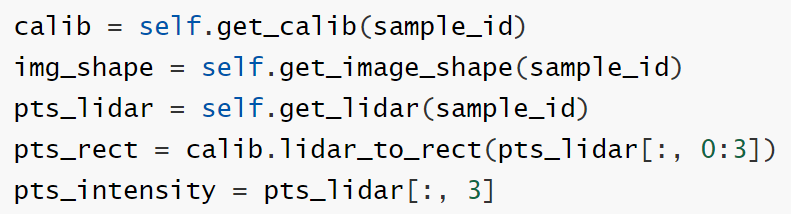

可以看到它不止读取了点云，还读取了calibration file，然后调用`calib.lidar_to_rect`对进行点云做校正。

下面是我改写过的代码：

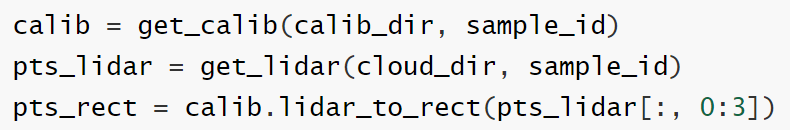

本来`get_calib`及`get_lidar`是`KittiRCNNDataset`类的成员函数，所以可以直接使用`calib_dir`及`cloud_dir`这两个成员变量。我这里则是直接把`get_calib`及`get_lidar`这两个函数搬出来作为独立的函数，然后为他们加上必要的参数（`calib_dir`及`cloud_dir`）。

读取标签的代码是参考自`get_proposal_from_file`：

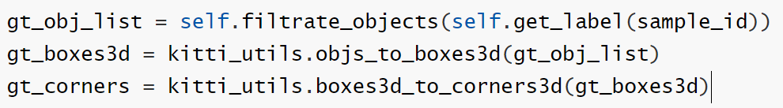

我将它改写成：

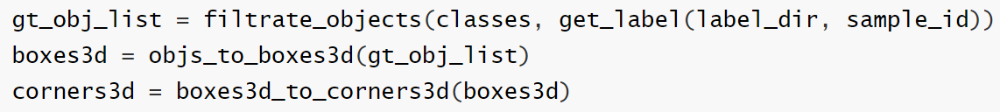

有了点云及标签后，下一步是实际把点云中被框住的点取出来，作为等会训练PointNet的样本。这一步在`kitti_rcnn_dataset.py`的`get_rcnn_sample_info`函数中已经有实现了。但这件事我是在作业完成后经助教提醒才发现的，所以下面还是分享我原来的做法：

先将点云及`corners3d`投影到水平面上，然后判断每个点是否落在长方形内，对于落在长方形内的点，再判断它们在高度方向上是否满足要求。其中"判断每个点是否落在长方形内"的代码是参考自https://stackoverflow.com/questions/21339448/how-to-get-list-of-points-inside-a-polygon-in-python。

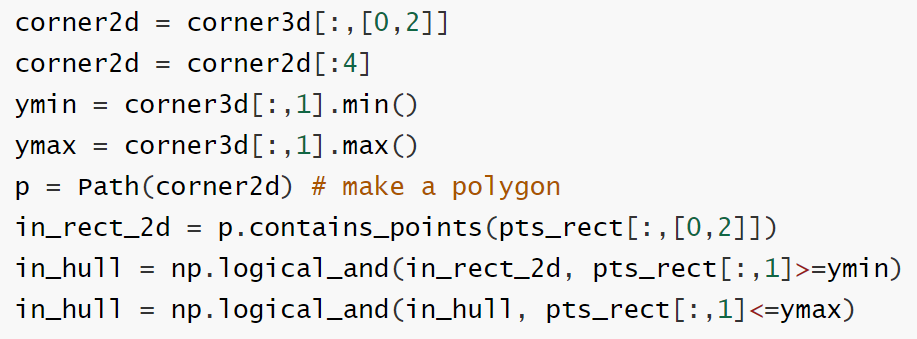

注意“把`corners3d`投影到水平面上”这部分，我用的是`corner2d = corner3d[:,[0,2]]`，这代表保留长方体的x,z坐标，忽略y坐标。这是因为在KITTI数据集中，y方向才是高度方向。

最后得到的`in_hull`是一个bool array，可以判断点云中的哪些点被`corner3d`包围。

有了各类物体的点云后，接下来是把它们切成训练集及测试集。

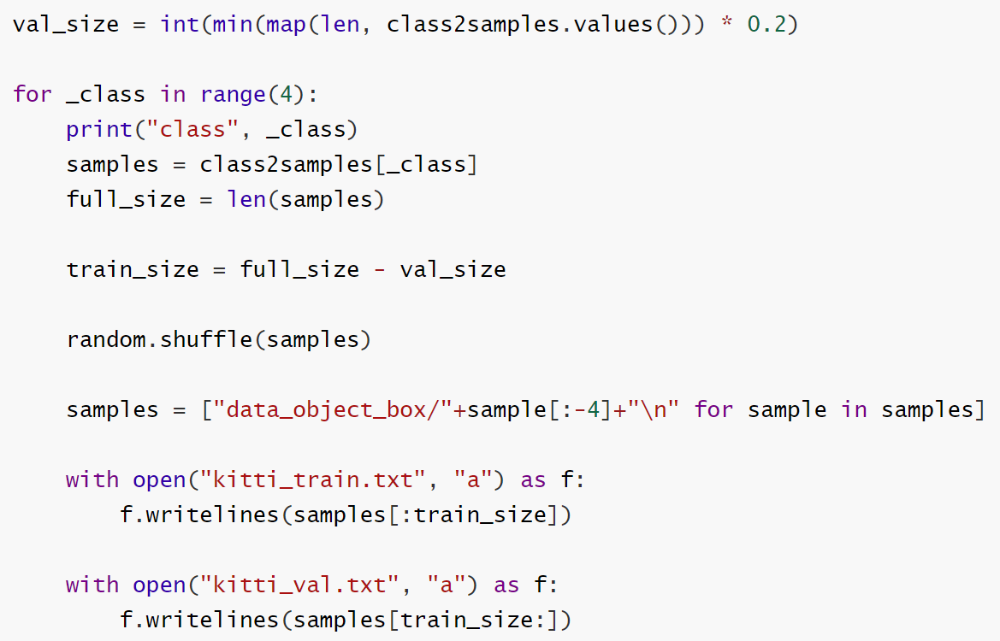

`class2samples`是一个dict，key是0,1,2,3等四个类别，value是属于该类别的文件名称的list。上面的代码就是将各类别都依照8:2的比例来切成训练集及测试集。

假设我们已经有了数据集跟模型（第五章的作业），在把数据丢进模型内前，还需要做transformation。

首先是坐标系转换：在原来KITTI的坐标系中，高度方向为y方向，这里将它转成以z方向为高度方向：

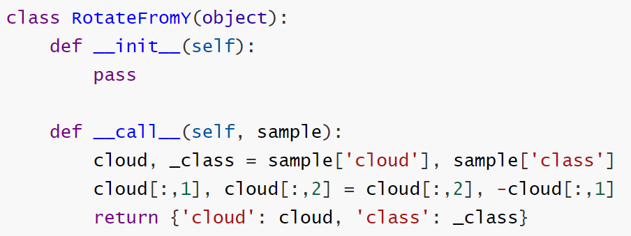

然后是Input Dropout：将输入点云随机下采样成1000个点：

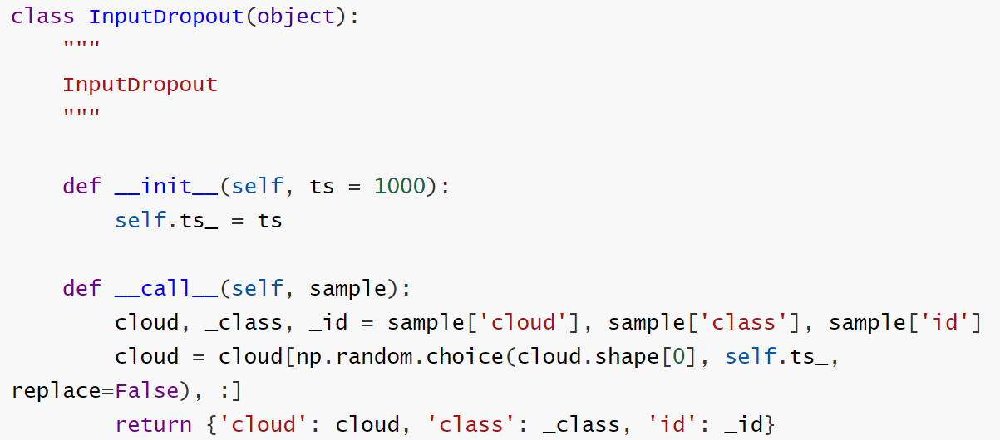

然后是做normalize，这一步是常规操作：

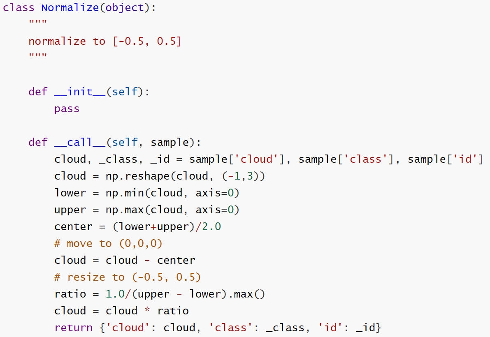

再来是数据增强，包括沿着z轴旋转任意角度，以及添加高斯噪声。以下是让点云沿着z轴旋转任意角度的代码：

还有添加高斯噪声的代码：

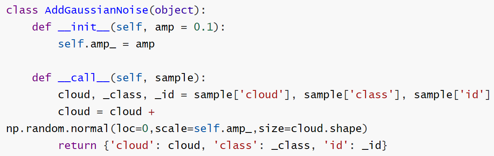

在准备数据集的时候应该有注意到，车的数量远多于其他类别，约为3000多，最少的是行人，只有三十几个样本。为了处理这种类别不均衡的问题，有一种方法是在训练时对各类别使用不同的权重做采样，代码如下：

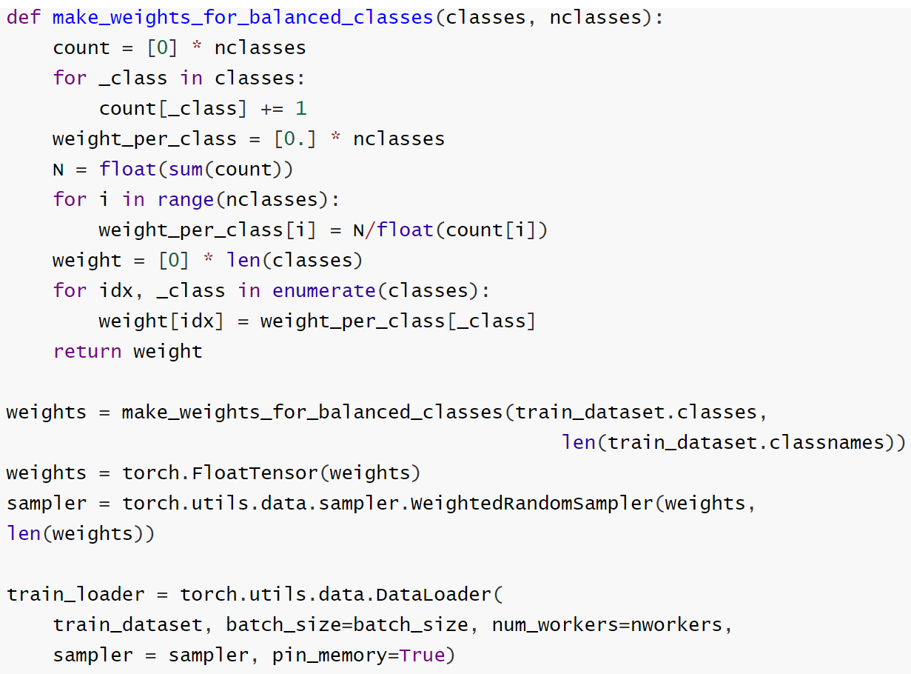

这里的代码是参考https://discuss.pytorch.org/t/balanced-sampling-between-classes-with-torchvision-dataloader/2703/3，核心思想是让样本数较多的类别有较低的权重，使得模型在训练时能均匀地看到各类别的样本。

以上的准备工作做完后，就可以开始训练模型了。

模型训练完成后，开始接下来测试的流程。测试的前两步是移除地面及聚类，由于这是前几次作业的内容，这边就不再赘述。得到聚类出来的点云后，可以先设定一些规则，排除不可能是车，人或骑单车的人其中之一的点云。

我用的规则是排除点数少于某一个阈值的点云，还有排除长，宽或高大于3米的点云：

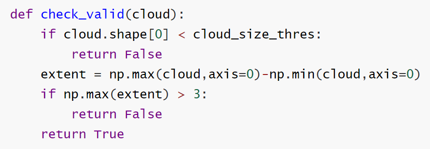

我们的训练数据是已经转为rect坐标系的点云，所以在测试时，也要将从bin文件里读取的点云转为rect坐标系才能送进神经网络。

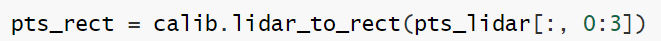

另外，在训练时，我们是将每个样本的点数都下采样到1000；在测试时，我们可以将batch size设为1，然后针对每个样本，将PointNet的pool层的kernel size设为该样本的点数。如此一来，就能把整个点云送进神经网络进行推论而不需要进行下采样，理论上应该会有较好的效果。下面是用于推论的代码：

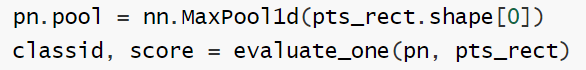

当中调用到的`evaluate_one`函数：

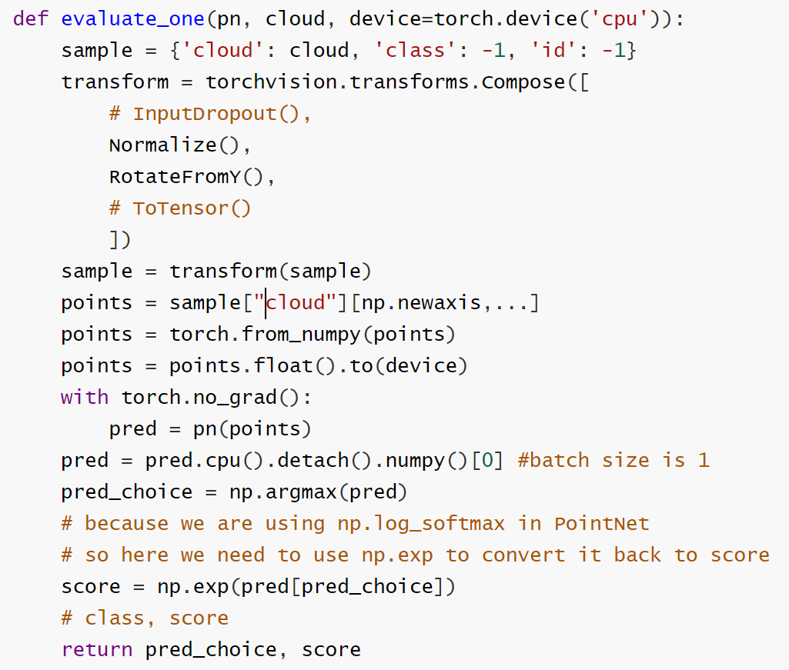

最后一步是将神经网络的输出转成KITTI的格式，这里我是参考https://github.com/sshaoshuai/PointRCNN/blob/master/tools/eval_rcnn.py里的写法，先准备`save_kitti_format`函数所需要的参数，然后再调用`save_kitti_format`函数。

以下是我改写过的`save_kitti_format`函数：

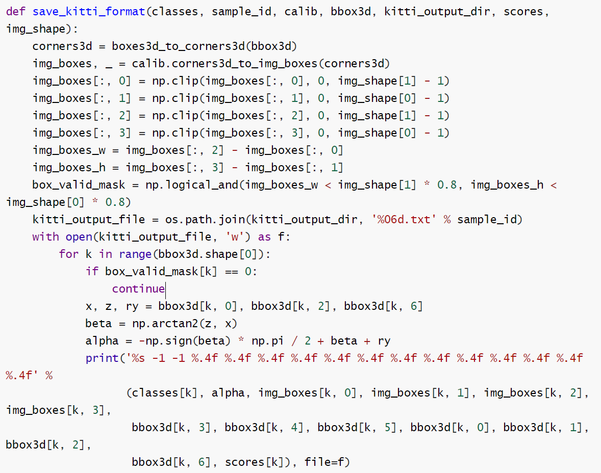

它的参数有`classes`, `sample_id`, `calib`, `boxes3d`,`kitti_output_dir`, `scores`,`image_shape`。其中`sample_id`,`calib`,`kitti_output_dir`,`image_shape`比较简单。

`classes`是将各cluster的类别收集到一个list里，`scores`亦然。

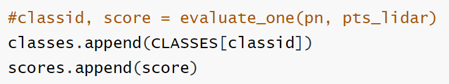

接下来是准备`boxes3d`，它是由`location`,`dimensions`及`rotation_y`所组成。`location`表示bounding box的中心点。`dimensions`表示bounding box的height, width及length，这里同样要注意：代表高度方向的是y方向。`rotation_y`则设为0，表示预测出来的bounding box没有沿y轴旋转。

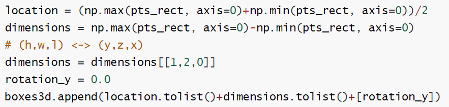

准备好所需的参数后，就可以调用`save_kitti_format`来储存目标检测结果了：

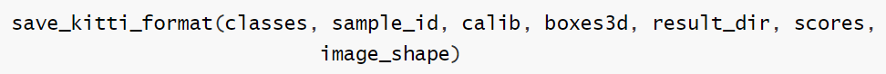