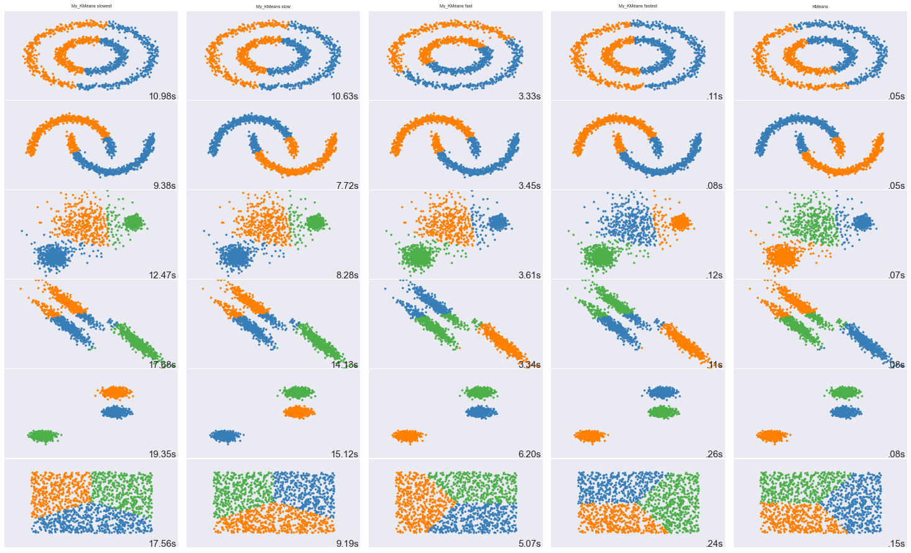
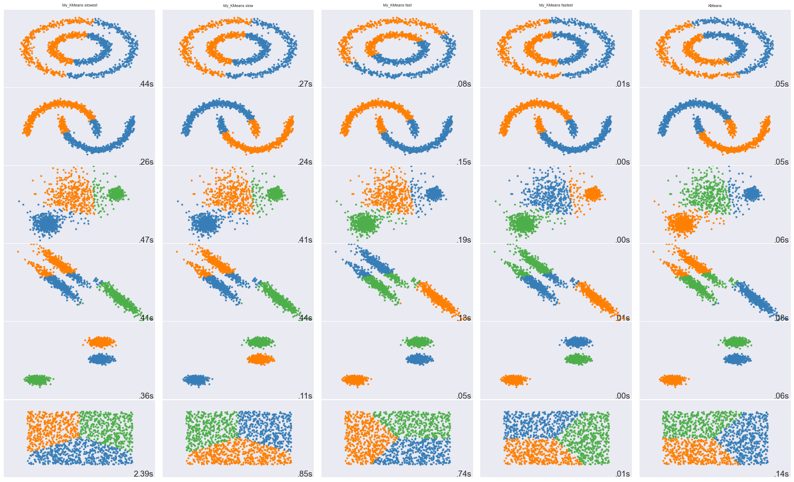
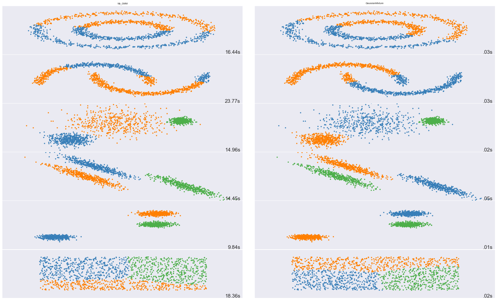
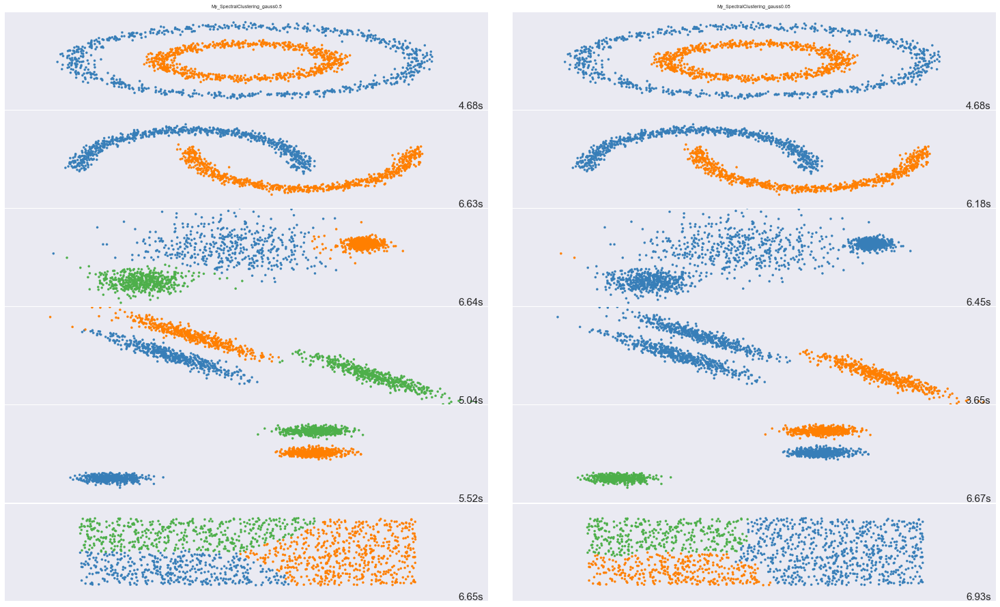
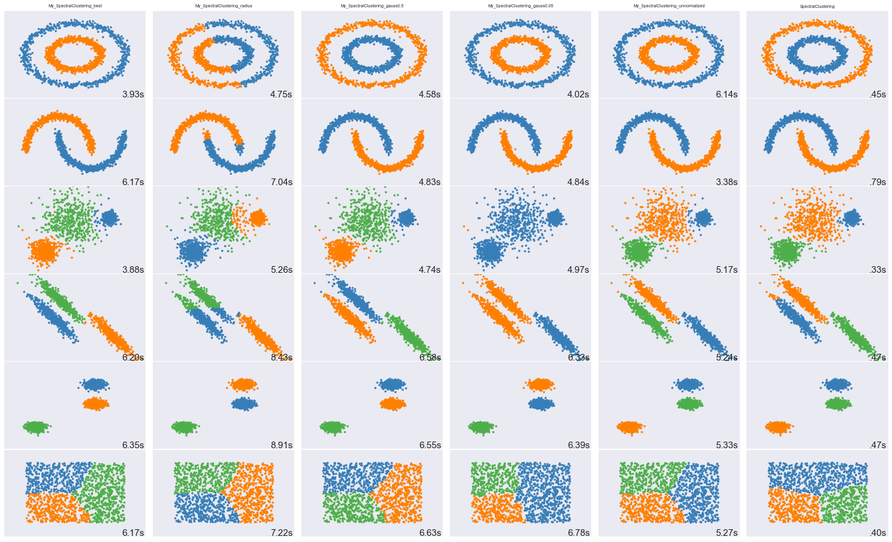
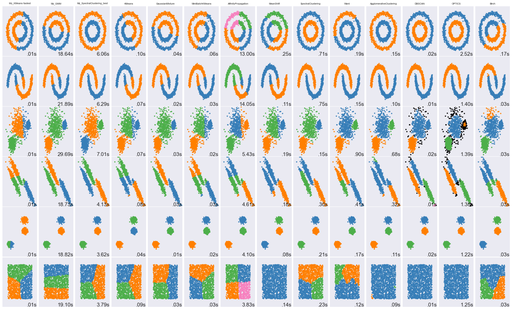

# 作业三

# 文件

除`compare_cluster.py`,`GMM.py`,`KMeans.py`外，还有如下文件：

- `SpectralClustering.py`:自己实现的谱聚类算法

# 依赖

- tqdm

# K-means

假设每笔数据都是一个长度为`dim`的向量。

## 初始化

新增一个成员变量`self.centers_`，为一`self.k_`*`dim`的二维数组。

## fit

fit函数分为三部分：第一步随机挑选`self.k_`个点作为cluster的中心、第二步E-step:把点分配到最近的cluster、第三步M-step:重新计算各cluster的中心，其中二三步是交替进行的。

### 第一步

用：

```python
self.centers_ = data[np.random.choice(m, self.k_, replace=False)]
```

随机挑选`[0,m-1]`里的`self.k_`个数字，作为`data`的索引，相当于从`data`里随机选`self.k_`笔数据作为一开始的中心点。

### 第二步

用两层for循环计算每笔数据到各cluster中心的距离，将数据分配到离它最近的cluster里：

```python
sums = np.zeros((self.k_, dim))
counts = np.zeros(self.k_, dtype=int)
distortion = 0
        
assigned = np.empty(m, dtype=int)
for di, datum in enumerate(data):
    dist = float("inf")
    for ci, center in enumerate(self.centers_):
        if np.linalg.norm(datum - center) < dist:
            dist = np.linalg.norm(datum - center)
            assigned[di] = ci
    sums[assigned[di]] += datum
    counts[assigned[di]] += 1
    distortion += dist*dist
```

其中数组`assigned`用于记录`data`里的每笔数据被分配到哪个cluster里。

`sums`记录各个cluster里所有数据点之和，`counts`用于记录各个cluster里都有多少个点，这两各数据结构是在M-step才会用到。

还有一个变量`distortion`，代表课件第20页的distortion measure。

（在没有设停止条件的情况下）因为使用双层循环的耗时过久（下图最左边slowest），所以以下尝试了几种方法来进行加速（下图左2slow，左3fast，左4fastest）。



#### 加速方法一：上图slow

在原方法中，是使用`O(self.k_)`的循环来寻找一笔数据与哪一个中心点最近。这里使用`np.linalg.norm`一次算出一笔数据与所有中心点的距离，然后寻找最小值，从而避免了循环的使用。

```python
dists = np.linalg.norm(self.centers_-datum, axis=1)
assigned[di] = np.argmin(dists)
mindist = dists[assigned[di]]
```

#### 加速方法二：上图fast

在加速方法一中，因为`self.k_`通常很小，所以带来的加速并不明显。这里改成“一次算出一个中心点与所有数据点的距离”。`dist_mat`这个`m` * `self.k_` 的矩阵用于储存`m`个数据点到`self.k_`个中心点的距离。

得到距离后，再遍历数据点，更新`assigned`,`sums`,`counts`及`distortion` 。

```python
dist_mat = np.empty((m, self.k_))
for ci, center in enumerate(self.centers_):
    dist_mat[:,ci] = np.linalg.norm(data-center, axis=1)

for di, datum in enumerate(data):
    assigned[di] = np.argmin(dist_mat[di])
    sums[assigned[di]] += datum
    counts[assigned[di]] += 1
    distortion += dist_mat[di][assigned[di]] * dist_mat[di][assigned[di]]
```

因为`m >> self.k_`，这次带来的加速就十分明显了。

#### 加速方法三：上图fastest

在加速方法二中，使用了`O(m)`的循环来更新数据结构。这里则想办法把循环拿掉，或改用较小的循环。

如`assigned`及`distortion`，可以用如下一行numpy语句解决。

`counts`及`sums`的计算则是改成在`O(self.k_)`的循环里面完成。

```python
# optimize from method 2, not using O(m) loop
assigned = np.argmin(dist_mat, axis=1)
distortion = (np.min(dist_mat, axis=1)**2).sum()

# O(self.k_) loop << O(m) loop
for ci in range(self.k_):
    counts[ci] = np.count_nonzero(assigned==ci)
    sums[ci] = data[np.where(assigned==ci)].sum(axis=0)
```

到了这里，已经跟sklearn的kmeans速度相去不远。

### 第三步

这一步重新计算各cluster的中心点，只要拿上一步算的和除以数量即可：

```python
for i in range(self.k_):
    self.centers_[i] = sums[i]/counts[i]
```

### 停止条件

distortion measure是越小越好。在每一轮迭代过程中都会计算一次distortion measure，如果到了某轮其值与前一次的差值小于`self.tolerance_`，就跳出循环。

```python
if (last_distortion - distortion) < self.tolerance_:
    break
```

上面的图是没有设停止条件的耗时，如果设了停止条件，则多数都能在1s内结束：



## predict

计算每笔数据到各cluster中心点的距离，取距离最小的。

# GMM
## 初始化

我在初始化函数里加了两个可选参数：`dim`及`tolerance`。因为在初始化高斯模型参数的时候需要知道数据的维度，所以加了`dim`。`tolerance`则类似KMeans里的`tolerance`，用于判断算法是否收敛。

```python
self.weights = np.ones(n_clusters)/n_clusters
self.means = np.random.random((n_clusters, self.dim))
self.covs = np.array(n_clusters * [np.identity(self.dim)])
self.tolerance = tolerance 
```

`self.weights`是课件里的$\pi$，是个长度为`n_clusters`的向量。

`self.means`及`self.covs`是高斯模型的平均值及协方差矩阵。

每个高斯模型的平均值一开始设为长度为`self.dim`的随机向量，协方差矩阵设为单位矩阵。

## 高斯函数

在fit及predict时都需要计算高斯函数的值，所以将它独立成一个函数。

```python
def _gauss(self, j, datum):
    return 1/pow(2*np.pi, self.dim/2) * \
(1/pow(np.linalg.det(self.covs[j]), 0.5)) * \
np.exp(-1/2*np.dot(np.dot((datum-self.means[j]).T, 
                          np.linalg.inv(self.covs[j])),
                   (datum-self.means[j])))
```

$N(x| \mu, \Sigma) = \frac{1}{(2\pi)^{D/2}}\frac{1}{|\Sigma|^{(1/2)}}e^{(-\frac{1}{2}(x-\mu)^T\Sigma^{-1}(x-\mu))}$

公式的第二项$|\Sigma|$需计算行列式，使用`np.linalg.det`。

公式的第三项的$(x-\mu)^T$是`self.dim` * `1`的向量，$\Sigma^{-1}$是`self.dim` * `self.dim`的向量，$(x-\mu)$是 `1` * `self.dim`的向量。

已用以下代码确认`self._gauss`的计算结果无误：

```python
pdf_official = multivariate_normal.pdf(datum, 
    mean=self.means[j], cov=self.covs[j])
print("pdf official:", pdf_official)
print("pdf self:", self._gauss(j, datum))
assert(np.allclose(pdf_official, self._gauss(j, datum)))
```

## fit

### E-step

计算后验概率，也就是每笔数据属于各个高斯模型的概率。

```python
# posterior probability
post_probs = np.zeros((N, self.n_clusters))

for i, datum in enumerate(data):
    for j in range(self.n_clusters):
        post_probs[i][j] = self.weights[j]*self._gauss(j, datum)

    post_probs[i] /= post_probs[i].sum()
```

我的写法是在内层循环算好分子，内层循环结束后再除以分母（也就是`post_probs[i].sum()`）。

### M-step

```python
for j in range(self.n_clusters):
    N_j = post_probs[:,j].sum()
    self.means[j] = post_probs[:,j].dot(data) / N_j
    self.covs[j] = np.zeros((self.dim, self.dim))
    for i in range(N):
        diff = np.array([data[i] - self.means[j]])
        self.covs[j] += post_probs[i][j] * \
            np.matmul(diff.T, diff)
    self.covs[j] /= N_j
    self.weights[j] = N_j/N
```

`N_j`:第j个群的effective number of points。

#### mean

每笔数据都乘上它属于该群的概率，求加权和，再做归一化（除以`N_j`）。

#### covariance

`diff`为第i笔数据与第j个群中心的差，为一`self.dim` * `1`的矩阵。`diff.T`与`diff`做乘法得到`self.dim` * `self.dim`的矩阵。然后求加权和再归一化。

#### weights

`N_j`做归一化（这里是除以`N`）。

#### log likelihood

log likelihood:用于判断算法是否收敛。

```python
log_likelihood = 0
for i in range(N):
    tmp = 0
    for j in range(self.n_clusters):
        tmp += self.weights[j] * self._gauss(j, data[i])
    log_likelihood += np.log(tmp)
```
### 停止条件

log_likelihood是越大越好。在每一轮迭代过程中都会计算一次log_likelihood，如果到了某轮其值与前一次的差值小于`self.tolerance_`，就跳出循环。

```python
if log_likelihood - last_log_likelihood < self.tolerance:
    break
```

参考`sklearn.mixture.GaussianMixture`，我将`self.tolearance`设为`0.001`。

未设停止条件：


设了停止条件：



## predict

算出后验概率之后，取概率最大者。

```python
def predict(self, data):
    # 屏蔽开始
    N = data.shape[0]
  
    post_probs = np.zeros((N, self.n_clusters))

    for i, datum in enumerate(data):
        for j in range(self.n_clusters):
            post_probs[i][j] = self.weights[j]*self._gauss(j, datum)
        
        post_probs[i] /= post_probs[i].sum()
    
    return np.argmax(post_probs, axis=1)
```


# 谱聚类

## fit

此处算法与课件p.69/70相同，但在“寻找最近邻”，“计算相似度”，“计算L”等处用了几种不同的方法。

一个比较坑的地方是在计算V矩阵时，`numpy.lingalg.eig`不会对特征值进行排序，需要自己手动排序。

```python
eigvals, eigvecs = LA.eig(L)
sorted_idx = np.argsort(eigvals)
# smallest self.k_ eigenvectors
V = eigvecs[:, sorted_idx[:self.k_]]
```

### 寻找最近邻

使用了KNN及radius search两种：

```python
if self.use_radius_nn_:
    nis, ndists = tree.query_radius([datum], self.nnradius_, 
                                    return_distance=True)
else:
    # the order of return value is different from query_radius!
    ndists, nis = tree.query([datum], self.nnk_+1, 
                             return_distance=True)
```

实验发现KNN的K取太小会出现"V矩阵带虚数"的问题；radius search的半径取太小会出现`LinAlgError: Singular matrix`的问题。

KNN的K取50实验效果较好，结果就跟sklearn的谱聚类差不多；radius search半径取1效果较好，但是没办法把两个同心圆分开。

### 相似度

由距离计算相似度的方法我写了两种，分别是：

- 距离的倒数
- 将距离代入高斯函数的结果

```python
if self.use_gauss_dist_:
    W[di][ni] = W[ni][di] = self.gauss_(ndist)
else:
    W[di][ni] = W[ni][di] = 1/ndist
```

高斯函数（用于将距离转换成相似度）：

```python
def gauss_(self, x):
    sigma = 1e-1
    return np.exp(-x*x/(2*sigma*sigma))
```

高斯函数的sigma取太小会出现"V矩阵带虚数"或是某些类分不开的问题。实验发现使用距离的倒数及sigma取0.5时的效果都与sklearn的谱聚类差不多。

下图是高斯函数的sigma取0.5/0.05的运行结果。取0.05时第三，四种数据集聚类效果不好。



### normalization

下面是$L_{rw}$的两种算法，用`np.allclose`确认结果无误。

```python
if self.normalized_:
    L = a = np.matmul(LA.inv(D), L)
    L = b = np.identity(m) - np.matmul(LA.inv(D), W)
    assert(np.allclose(a,b))
```

## predict

根据在群里与老师讨论的结果，谱聚类要对新数据做分类似乎比较困难，所以`predict`函数为空：

```python
def predict(self, p_datas):
    pass
```

它只能对训练数据进行分类。在`fit`函数的末行，调用Kmeans做分类：

```python
self.labels_ = KMeans(n_clusters=self.k_).fit_predict(V)
```



左一：KNN的K取50，用距离倒数算相似度，normalized（效果最好）

左二：radius search的radius取1，用距离倒数算相似度，normalized

左三：KNN的K取50，用高斯函数（sigma取0.5）算相似度，normalized（效果最好）

左四：KNN的K取50，用高斯函数（sigma取0.05）算相似度，normalized

左五：KNN的K取50，用距离倒数算相似度，unnormalized（效果最好）

左六：sklearn的谱聚类（效果最好）

# 运行结果

