# 作业四

# 文件

除`clustering.py`外，还有如下文件：

- `SampleConsensusModels.py`:RANSAC用的模型
- `RandomSampleConsensus.py`:实现RANSAC算法
- `HoughTransform.py`:实现Hough transform算法
- `LSQ.py`:实现LSQ算法

# 依赖

- tqdm
- glob
- scipy
- matplotlib
- sklearn
- collections

# 滤除地面

## RANSAC

参考PCL的设计，`SampleConsensusModel`类表示模型（如平面，直线等），`RandomSampleConsensus`类则负责实作RANSAC算法。

### SampleConsensusModel

在建构`SampleConsensusModel`对象时需传入`data`，表示将在这群数据点里寻找模型。`computeModelCoefficients`方法利用`self.points_need`个数据点，即`samples`，来计算模型参数。`getDistancesToModel`方法则计算点云里各点到模型的距离。

```python
class SampleConsensusModel(object):
    def __init__(self, data):
        self.data_ = data
    
    def computeModelCoefficients(self, samples):
        raise NotImplementedError()
    
    def getDistancesToModel(self):
        raise NotImplementedError()
```

### SampleConsensusModelPlane

`SampleConsensusModelPlane`继承自`SampleConsensusModel`，表示平面模型，代码如下。

```python
class SampleConsensusModelPlane(SampleConsensusModel):
    def __init__(self, data):
        super().__init__(data)
        self.points_need = 3
    
    def computeModelCoefficients(self, samples):
        self.p1 = samples[0]
        self.p2 = samples[1]
        self.p3 = samples[2]
        self.plane_normal = normalized(
            np.cross(self.p1-self.p2, self.p1-self.p3))
        return
    
    def getDistancesToModel(self):
        distances = np.empty(self.data_.shape[0])
        for i, datum in enumerate(self.data_):
            distances[i] = np.linalg.norm(
                self.plane_normal.dot(datum-self.p1))
        return distances
```

需要3个点才能决定一个平面，所以`self.points_need`为3。

`computeModelCoefficients`用于计算平面参数，`self.p1`,`self.p2`,`self.p3`表示平面经过的三个点，`self.plane_normal`则代表平面的法向量，由平面上两向量的外积计算而来。

在`getDistancesToModel`中，点$p$到平面的距离由以下公式计算：$\frac{|n\cdot (p-p1)|}{|n|}$。

### SampleConsensusModelLine

`SampleConsensusModelLine`继承自`SampleConsensusModel`，表示直线模型，代码如下。

```python
class SampleConsensusModelLine(SampleConsensusModel):
    def __init__(self, data):
        super().__init__(data)
        self.points_need = 2
    
    def computeModelCoefficients(self, samples):
        self.p1 = samples[0]
        self.p2 = samples[1]
        self.line_direction = normalized(samples[1]-samples[0])
        return
    
    def getDistancesToModel(self):
        distances = np.array(self.data_.shape[0])
        for i, datum in enumerate(self.data_):
            distances[i] = np.linalg.norm(
                np.cross(datum-self.p1, datum-self.p2))
        distances /= np.linalg.norm(self.p2-self.p1)
        return distances
```

需要2个点才能决定一个直线，所以`self.points_need`为2。

`computeModelCoefficients`用于计算直线参数，`self.p1`,`self.p2`表示直线经过的两个点，`self.line_direction`则代表直线的方向向量。

在`getDistancesToModel`中，点$p$到直线的距离由以下公式计算：$\frac{|(datum-p_1)\times(datum-p_2)|}{|p_2-p_1|}$。

### RandomSampleConsensus

在建构`RandomSampleConsensus`类的对象时，需要传入`SampleConsensusModel`类的对象，表示将用于寻找什么样的模型（目前支持平面及直线）。

它的方法`setDistanceThreshold`用于设定`dist_thres_`；`computeModel`实作RANSAC算法；`getInliers`则回传计算完的结果。

```python
class RandomSampleConsensus(object):
    def __init__(self, model : SampleConsensusModel, 
                 dist_thres : float = 0.01, max_iterations : int = 1000):
        self.model_ = model
        self.dist_thres_ = dist_thres
        self.max_iterations_ = max_iterations
    
    def setDistanceThreshold(self, dist_thres):
        self.dist_thres_ = dist_thres
    
    def computeModel(self):
        #...
        pass
    
    def getInliers(self):
        return self.inliers_
```

### computeModel方法

在`computeModel`中，每次随机挑选`model.points_need`个点，计算模型参数，然后计算点云中各点到模型的距离，以`self.dist_thres_`为阈值选取inliers，这样的过程重复`self.max_iterations_`次，选取inlier数量最多的模型作为最后的结果。

```python
def computeModel(self):
    max_inlier_count = 0
    model = self.model_
    for _ in tqdm(range(self.max_iterations_)):
        sample = model.data_[np.random.choice(model.data_.shape[0], model.points_need, replace = False), :]
        model.computeModelCoefficients(sample)
        distances = model.getDistancesToModel()
        inlier_count = np.count_nonzero(distances <= self.dist_thres_)
        if inlier_count > max_inlier_count:
            max_inlier_count = inlier_count
            self.model_ = model
            self.inliers_ = np.where(distances <= self.dist_thres_)
```

### 参数选择

```python
plane_model = SampleConsensusModelPlane(data)
p = 0.99
e = 1 - 47549/115384
max_iterations = (int)(np.log(1-p)/np.log(1-pow(1-e, plane_model.points_need)))
ransac = RandomSampleConsensus(plane_model, max_iterations=max_iterations)
ransac.setDistanceThreshold(0.5)
ransac.computeModel()
inliers = ransac.getInliers()
```

根据第72页的公式来计算RANSAC需要的迭代次数：$N = \frac{log(1-p)}{log(1-(1-e)^s)}$

- `p`取0.99
- `e`:000000.bin约有115384个点，其中约47549个点为inlier，因此`e = 1 - 47549/115384 = 0.58`
- `s`:需要3个点来决定一个平面

所以`N`约为63。

RANSAC的distance threshold选择0.5，这是手动调出来的。

### 计算结果

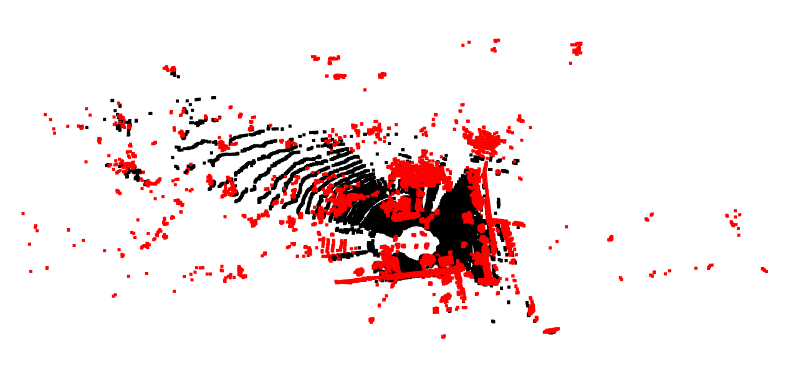

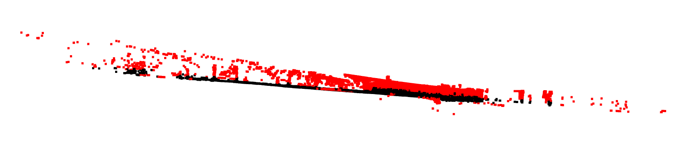

## Hough Transform

### HoughTransform类

在建构`HoughTransform`对象时需要传入模型种类（目前只支持平面）及resolution。

`computeModel`方法会依据`self.model_`来挑选模型种类。`getInliers`用于返回点云中属于模型的点。

```python
class HoughTransform(object):
    def __init__(self, model : 0, resolution : float):
        self.model_ = model
        self.resolution_ = resolution
        self.inliers_ = []
    
    def computeModelPlane_(self, data):
        #...
        pass
    
    def computeModel(self, data):
        if self.model_ == 0:
            self.computeModelPlane_(data)
    
    def getInliers(self):
        return self.inliers_
```

### computeModelPlane_方法

以下是`computeModelPlane_`方法：

```python
def computeModelPlane_(self, data):
    X = data
    X = StandardScaler().fit_transform(X)
    grid2count = defaultdict(lambda : 
                    defaultdict(lambda : 
                        defaultdict(lambda : [])))
    
    for mx in np.arange(-1.0, 1.0, self.resolution_):
        for my in tqdm(np.arange(-1.0, 1.0, self.resolution_)):
            for i, (x,y,z) in enumerate(X):
                rho = z-mx*x-my*y
                # take floor
                rho = rho//self.resolution_*self.resolution_
                # inliers
                grid2count[mx][my][rho].append(i)
    
    for mx, xgrids in grid2count.items():
        for my, ygrids in xgrids.items():
            for rho, inliers in ygrids.items():
                if len(inliers) > len(self.inliers_):
                    self.inliers_ = inliers
                    self.param_ = (mx, my, rho)
```

参考[The  3D  Hough  Transform  for  Plane  Detection  in  Point  Clouds:  A  Review and a new Accumulator Design]( https://robotik.informatik.uni-wuerzburg.de/telematics/download/3dresearch2011.pdf)，将平面表示为$z = mx*x+my*y+rho$，所以参数空间由$(mx,my,rho)$所构成。

在`computeModelPlane_`方法中，先将`X`标准化，然后遍历参数空间并计数，最后从`grid2count`这个三维的counter中选取inlier最多的模型作为计算结果。

### 参数选择

```python
ht = HoughTransform(model = 0, resolution = 0.4)
ht.computeModel(data)
inliers = ht.getInliers()
```

`resolution`值设为0.4，这是手动调出来的。

### 计算结果

有些属于平面的点没被挑出来，结果稍差于RANSAC。


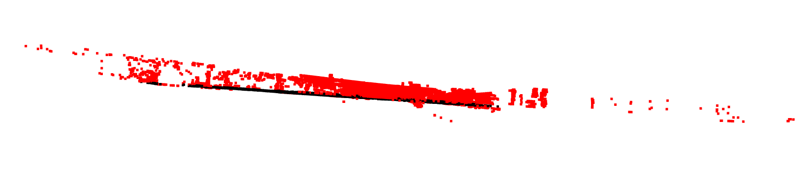

## LSQ

### LSQ类

在建构`LSQ`对象时需要传入模型种类`model`（目前只支持平面）及`dist_thres`。

`computeModel`及`getInliers`跟`HoughTransform`里的类似。`cauchy`及`huber`用于计算cauchy loss及huber loss。

```python
class LSQ(object):
    def __init__(self, model = 0, dist_thres : float = 0.1):
        self.model_ = model
        self.param_ = None
        self.dist_thres_ = dist_thres
        self.inliers_ = []
        self.huber_delta_ = 1.0

    def cauchy(self, x, A, b):
        #...
        pass
    
    def huber(self, x, A, b):
        #...
        pass
    
    def computeModelPlane_(self, data):
        #...
        pass
    
    def computeModel(self, data):
        if self.model_ == 0:
            self.computeModelPlane_(data)
    
    def getInliers(self):
        return self.inliers_
```

### computeModelPlane_方法

```python
def computeModelPlane_(self, data):
    """
    z = ax+by+c
    """
    m = data.shape[0]
    
    X = data
    X = StandardScaler().fit_transform(X)
    
    A = np.c_[X[:, :2], np.ones(m)]
    b = X[:, 2:]
    
    A = np.matrix(A)
    b = np.matrix(b)
    
    self.param_ = np.linalg.inv(A.T * A) * A.T * b
    
    if self.loss_fnc_ == 1:
        self.param_, cov, infodict, msg, ier = leastsq(self.cauchy, 
                self.param_, args=(A, b), full_output=True)
    elif self.loss_fnc_ == 2:
        self.param_, cov, infodict, msg, ier = leastsq(self.huber, 
                self.param_, args=(A, b), full_output=True)
    
    self.param_ = np.array(self.param_)
    self.inliers_ = []
    dists = []
    for i, datum in enumerate(X):
        dist = np.linalg.norm(datum.dot(self.param_))
        dists.append(dist)
        if dist < self.dist_thres_:
            self.inliers_.append(i)
    
    plt.hist(dists)
```

在`self.loss_fnc_`为0时，使用L2 loss，解为$(A^TA)^{-1}A^Tb$；否则使用第一阶段的解作为starting estimate，然后调用`scipy.optimize.leastsq`，loss function选择cauchy或huber进行优化。最后再根据`self.dist_thres_`找出inliers。

以下是cauchy及huber loss：

```python
def cauchy(self, x, A, b):
    x = np.reshape(x, (3,1))
    err = A*x - b
    res = np.log(1+np.abs(err))
    res = np.array(res).flatten()
    return res
```

```python
def huber(self, x, A, b):
    x = np.reshape(x, (3, 1))
    res = np.zeros(A.shape[0])
    err = A*x - b
    err = np.array(err).flatten()
    err_lt_idxs = np.where(np.abs(err) < self.huber_delta_)[0]
    err_ge_idxs = np.where(np.abs(err) >= self.huber_delta_)[0]
    res[err_lt_idxs] = np.power(err[err_lt_idxs], 2)
    res[err_ge_idxs] = 2 * self.huber_delta_* \
        (np.abs(err[err_ge_idxs]) - self.huber_delta_/2)
    return res
```

### 参数选择

```python
lsq = LSQ(model = 0, dist_thres = 0.1)
lsq.computeModel(data)
inliers = lsq.getInliers()
```
`dist_thres`设为0.1，这是手动调出来的。

### 计算结果

#### L2 loss


#### cauchy loss

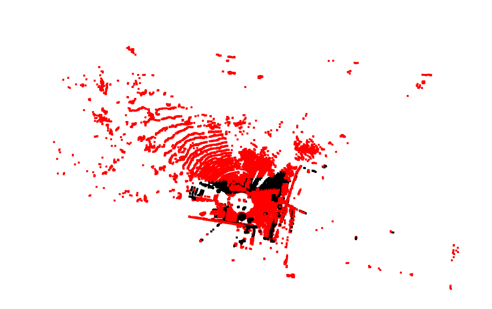

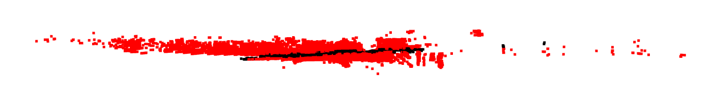

#### huber loss

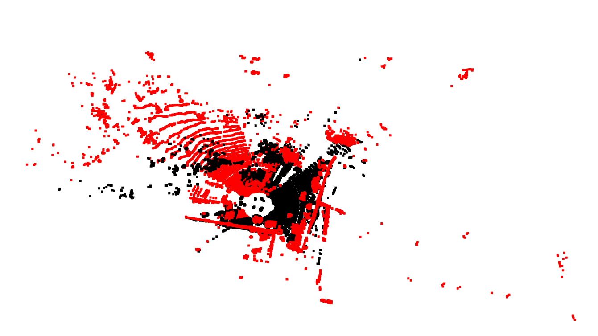

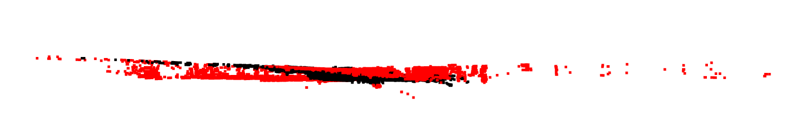

三个loss function中，huber loss效果最好，但是仍远比不上RANSAC和Hough Transfrom。

# 聚类

## 数据前处理

原来使用`StandardScaler`对数据进行标准化：

```python
X = segmented_points
X = StandardScaler().fit_transform(X)
```

但是后来发现聚类效果会变成：

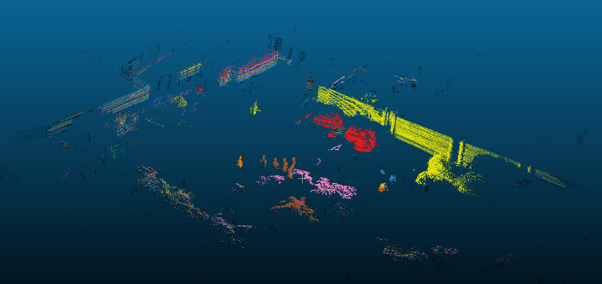

左上方的围墙在z方向被分成多段。后来想到这是因为在原始数据中，z方向的范围较小，所以scale过后z方向放大了好几倍，导致距离计算失准。

因此改用以下方式来标准化：

```python
X = segmented_points
scale = np.max(np.max(X, axis=0) - np.min(X, axis=0))
X -= np.mean(X, axis=0)
X /= scale
```

将数据中心点移到原点后，对x,y,z坐标都均匀地除以一个数，这样才不会出现z方向被放大好几倍的问题。

## DBSCAN

使用DBSCAN，需要调的有`eps`及`min_samples`这两个参数。

### 参数选择

DBSCAN的参数跟RANSAC比起来难调很多，所以用grid search来寻找合适的参数。

```python
for eps in [0.001, 0.003, 0.005]:
    for min_samples in [3,5,10,20,30,50,60,70,80,90,100]:
        dbscan = cluster.DBSCAN(eps=eps, 
            min_samples = min_samples, n_jobs=-1)
        dbscan.fit(X)
```

### 计算结果

以下为`eps=0.005`,`min_samples=20`（将点云输出为pcd后在CloudCompare里显示）：

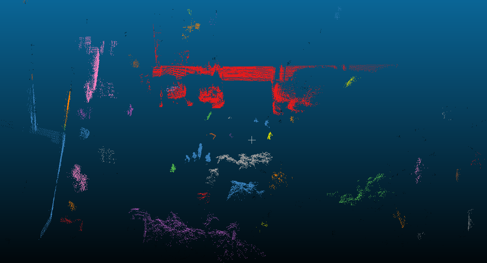以下为`eps=0.001`,`min_samples=20`：

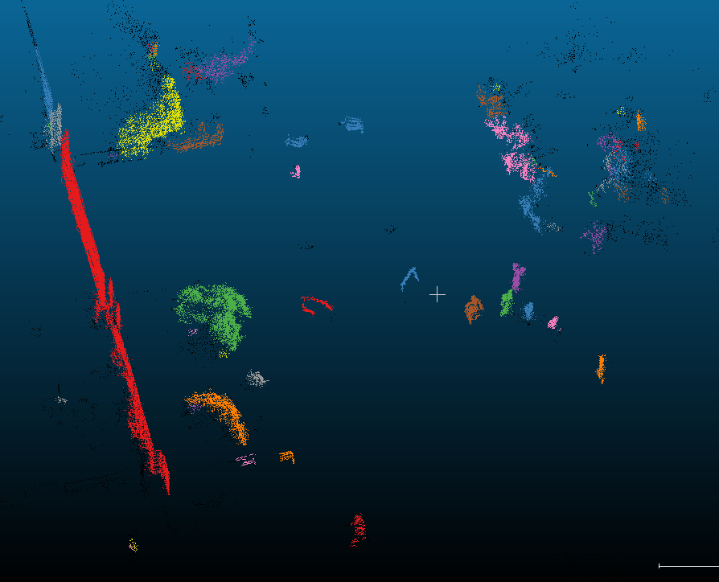

## MeanShift

### 参数选择

```python
#bandwidth = cluster.estimate_bandwidth(X, quantile=0.3, n_samples = 1000, n_jobs=-1)
bandwidth = 0.02
ms = cluster.MeanShift(bandwidth=bandwidth, bin_seeding=True, n_jobs=-1)
ms.fit(X)
```

手动调整`bandwidth`。

### 计算结果

bandwidth设为0.02

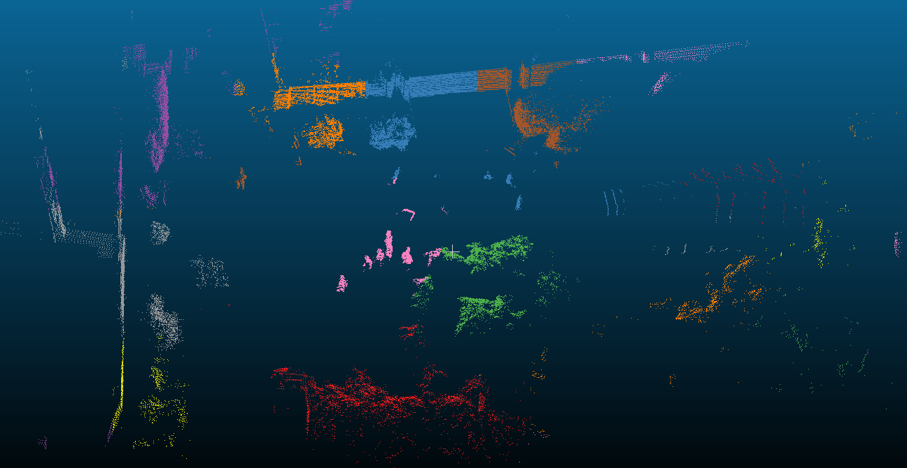

bandwidth设为0.05

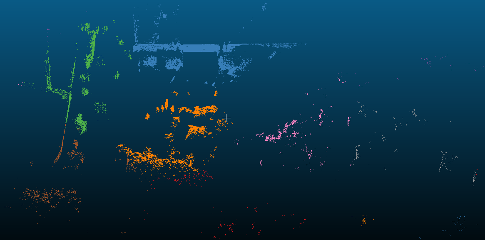

# 其他结果

以上实验结果都是基于`000001.bin`这个文件做出来的。下面是其他结果：


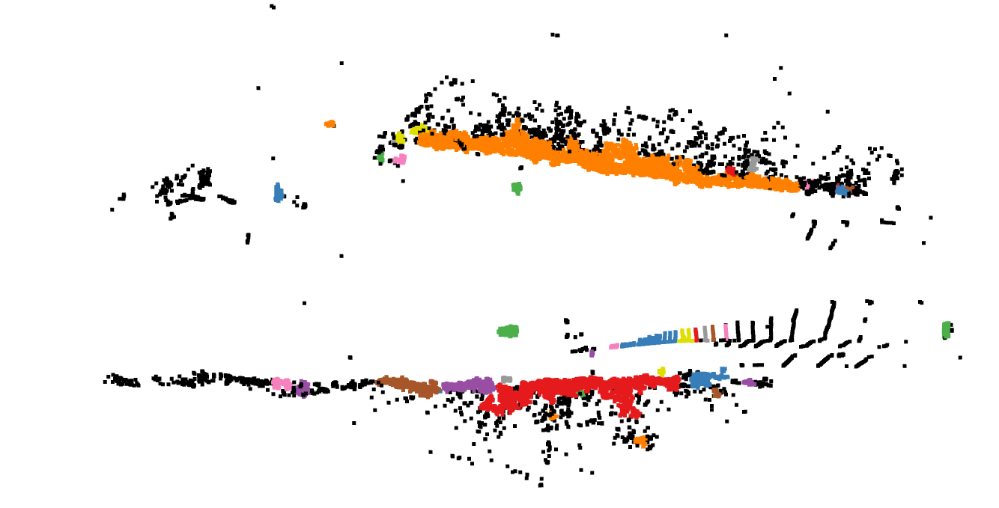


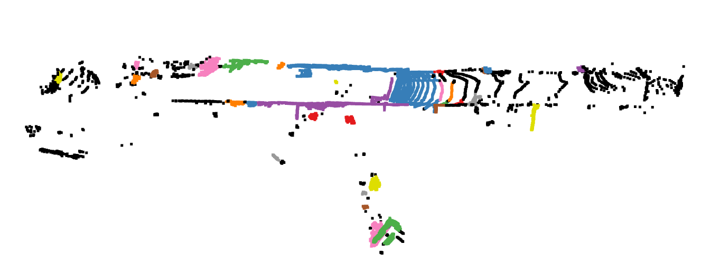


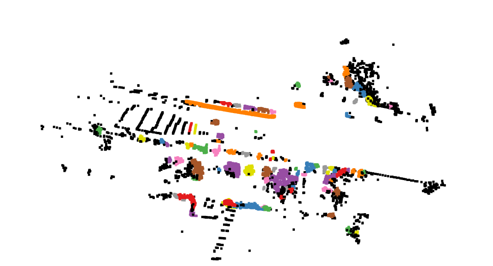