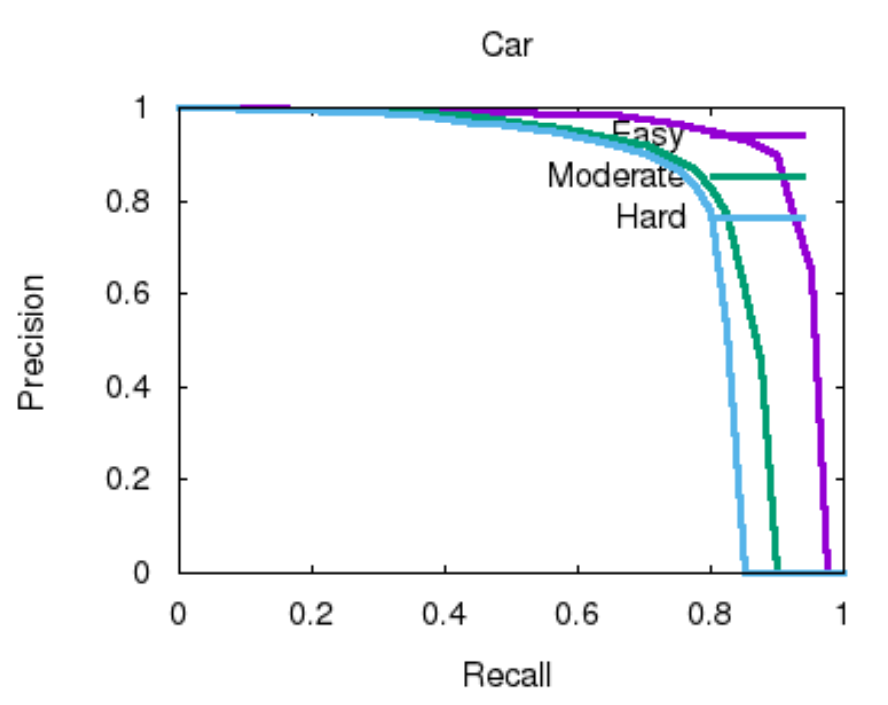

# p.55 formula


- 卷积输出大小计算公式：${\lfloor}(W+2P-F)/S{\rfloor}+1$
- 输入：$128*10*400*352$
- 第一层
  - c： $64$
  - z：${\lfloor}(10+2*1-3)/2{\rfloor}+1 = 5$
  - x：${\lfloor}(400+2*1-3)/1{\rfloor}+1 = 400$
  - y：${\lfloor}(352+2*1-3)/1{\rfloor}+1 = 352$
- 第二层
  - c： $64$
  - z：${\lfloor}(5+2*0-3)/1{\rfloor}+1 = 3$
  - x：${\lfloor}(400+2*1-3)/1{\rfloor}+1 = 400$
  - y：${\lfloor}(352+2*1-3)/1{\rfloor}+1 = 352$
- 第三层
  - c： $64$
  - z：${\lfloor}(3+2*1-3)/2{\rfloor}+1 = 2$
  - x：${\lfloor}(400+2*1-3)/1{\rfloor}+1 = 400$
  - y：${\lfloor}(352+2*1-3)/1{\rfloor}+1 = 352$

# setup kitti env

## Windows

```sh
apt-get update -y
apt-get install -y build-essential
g++ -O3 -DNDEBUG -o evaluate_object_3d_offline evaluate_object_3d_offline.cpp -I
"/mnt/c/Program Files/Boost/Boost 1.64.0/include/boost-1_64"
```

参考[error: 'make_array' is not a member of 'boost::serialization](https://stackoverflow.com/questions/44534516/error-make-array-is-not-a-member-of-boostserialization)

`C:\Program Files\Boost\Boost 1.64.0\include\boost-1_64\boost\numeric\ublas的storage.h`加上:

```cpp
#include <boost/serialization/array_wrapper.hpp>
```

## Linux

```sh
apt-get update -y
apt-get install -y build-essential
sudo apt-get install -y gnuplot
sudo apt-get install libboost-all-dev -y
g++ -O3 -DNDEBUG -o evaluate_3d_offline evaluate_object_3d_offline.cpp
```

# PointRCNN

使用[sshaoshuai/PointRCNN](https://github.com/sshaoshuai/PointRCNN)这个开源项目，这个项目是在Linux，PyTorch 1.0下运行的，为了让它可以在我的Windows+PyTorch1.7环境里运行，做了以下改动：

For Windows:

- `tools/eval_rcnn.py`里
  - `os.system('cp aaa bbb')`改为`os.system('copy aaa bbb')`

- `lib/utils/iou3d/src/iou3d.cpp`里
  - 添加`#include <torch/serialize/tensor.h>`及`#include <pybind11/pybind11.h>`
  - `unsigned long long remv_cpu[col_blocks];`改为`unsigned long long *remv_cpu = new unsigned long long[col_blocks];`
  - `long * pts_flag_flat = pts_flag.data<long>();`改为`long long * pts_flag_flat= pts_flag.data<long long>();`

For PyTorch1.7:


- 将`AT_CHECK`替换成`TORCH_CHECK`
- 将`THCState_getCurrentStream(state);`替换成`c10::cuda::getCurrentCUDAStream();`

另外，因为预训练的模型只接受三个通道，所以需要将intensity排除，但不知道为什么以下指令不管
用：

```sh
python eval_rcnn.py --cfg_file cfgs/default.yaml --ckpt ../PointRCNN.pth --
batch_size 1 --eval_mode rcnn --set RPN.LOC_XZ_FINE False RPN.USE_INTENSITY
False RCNN.USE_INTENSITY False
```

所以我的做法是直接修改`lib/config.py`：`__C.RPN.USE_INTENSITY = False`。

这个开源项目提供的预训练模型只能检测car一类，以下是它的PR curve：



# build KITTI classification dataset

利用[sshaoshuai/PointRCNN](https://github.com/sshaoshuai/PointRCNN)里的代码，从中截取出物体`dimensions`, `location`, `rotation_y`。

改自`create_dataloader`：

```python
def create_dataset(logger):
    mode = 'TEST' if args.test else 'EVAL'
    DATA_PATH = os.path.join('..', 'data')

    # create dataloader
    test_set = KittiRCNNDataset(root_dir=DATA_PATH, npoints=cfg.RPN.NUM_POINTS,
    split=cfg.TEST.SPLIT, mode=mode,
                                random_select=args.random_select,
                                rcnn_eval_roi_dir=args.rcnn_eval_roi_dir,

    rcnn_eval_feature_dir=args.rcnn_eval_feature_dir,
                                classes=cfg.CLASSES,
                                logger=logger)

    return test_set
```

改自`eval_single_ckpt`：

```python
def extract_point_cloud(root_result_dir):
    root_result_dir = os.path.join(root_result_dir, 'eval')
    # set epoch_id and output dir
    num_list = re.findall(r'\d+', args.ckpt) if args.ckpt is not None else []
    epoch_id = num_list[- 1 ] if num_list.__len__() > 0 else 'no_number'
    root_result_dir = os.path.join(root_result_dir, 'epoch_%s' % epoch_id,
    cfg.TEST.SPLIT)
    if args.test:
    	root_result_dir = os.path.join(root_result_dir, 'test_mode')

    if args.extra_tag != 'default':
        root_result_dir = os.path.join(root_result_dir, args.extra_tag)
    os.makedirs(root_result_dir, exist_ok=True)

    log_file = os.path.join(root_result_dir, 'log_eval_one.txt')
    logger = create_logger(log_file)
    logger.info('**********************Start logging**********************')
    for key, val in vars(args).items():
    	logger.info("{:16} {}".format(key, val))
    save_config_to_file(cfg, logger=logger)

    # create dataloader & network
    dataset = create_dataset(logger)

    for index in range(len(dataset)):
        sample_id = int(dataset.sample_id_list[index])
        gt_obj_list = dataset.filtrate_objects(dataset.get_label(sample_id))
        gt_boxes3d = kitti_utils.objs_to_boxes3d(gt_obj_list)
        print(index, gt_boxes3d)
```

得到的`gt_boxes3d`是n*7的矩阵。接下来是实际将输入点云用`gt_boxes3d`切出多个小长方体，作为分
类的数据集。（待完成）