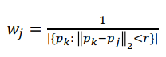
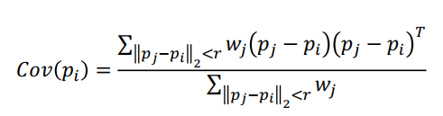
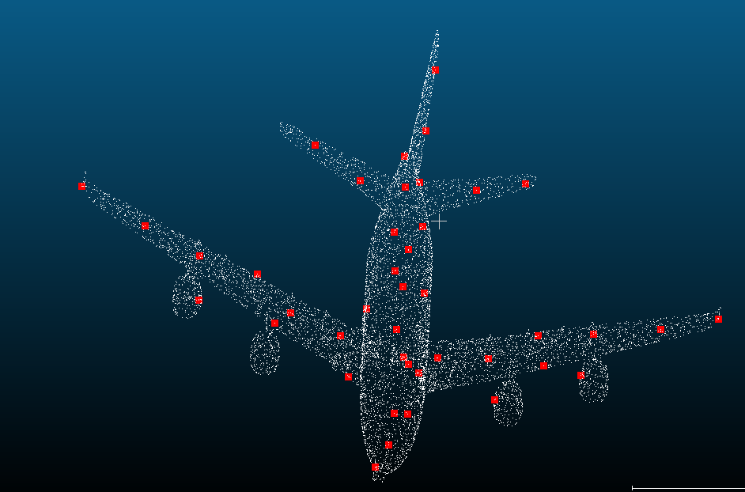
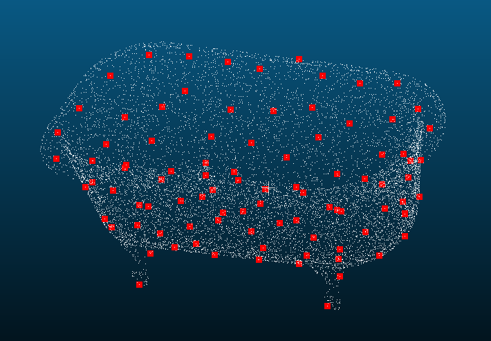
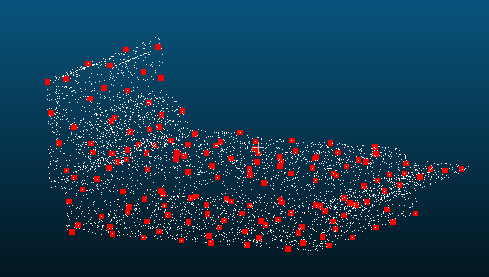

# ISS

`get_neighbors`函数计算`point_cloud_o3d`里各点在`radius`距离内的邻居。

```python
def get_neighbors(point_cloud_o3d, pcd_tree, radius):
    neighbors = []
    
    for point in point_cloud_o3d.points:
        cnt, idxs, dists = pcd_tree.search_radius_vector_3d(point, radius)
        neighbors.append(idxs)
    
    return neighbors
```

用一个名为`candidates`的`dict`记录点云里各点的lambda3及是否保留的bool值。

```python
# key: index of the point
# value: (score(lambda3), keep(used by NMS))
candidates = {}
```

对点云里的各点都做以下的事：

1. 计算其weighted covariance matrix

   

```python
numerator = np.zeros((3,3))
wsum = 0
for j in neighbors_salient_radius[i]:
    wj = 1/len(neighbors_salient_radius[j])
    diff = point_cloud_o3d.points[j] - point_cloud_o3d.points[i]
    numerator += wj * np.outer(diff, diff)
    wsum += wj
cov = numerator / wsum
```

2. 计算covariance matrix的eigenvalue并排序

```python
# need to substract mean before SVD?
u, s, vh = np.linalg.svd(cov, full_matrices=True)
eigenvalues = s
eigenvectors = u

# decreasing order
eigenvalues = sorted(eigenvalues, reverse=True)

lambda1, lambda2, lambda3 = eigenvalues
```
3. 依据下列条件判断是否该将该点视为feature point

   
```python
keep = lambda2/lambda1 < gamma_21 and lambda3/lambda2 < gamma_32

candidates[i] = [lambda3, keep]
```

得到`candidates`这个数据结构后，先依lambda3排序，然后再依lambda3对`non_max_radius`里的邻居做NMS。

```python
candidates = dict(sorted(candidates.items(), 
                         key=lambda item: item[1][0],
                         reverse = True))


neighbors_non_max = get_neighbors(point_cloud_o3d, pcd_tree, non_max_radius)

for idxi, (scorei, keepi) in candidates.items():
    # this candidate is already ruled out
    if not keepi: continue

    # suppress neighbors in radius r
    for idxj in neighbors_non_max[idxi]:
        if idxj == idxi: continue
        candidates[idxj][1] = False

feature_point_idxs = []
for idxi, (scorei, keepi) in candidates.items():
    if keepi:
        feature_point_idxs.append(idxi)
```

# result





