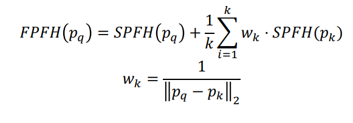
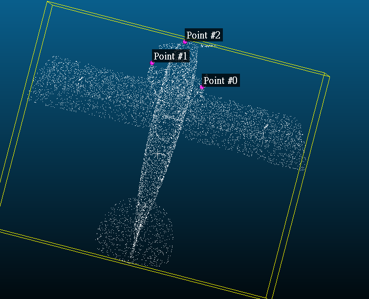
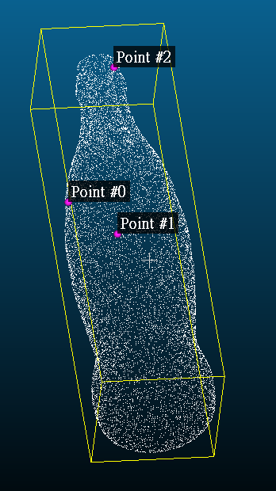
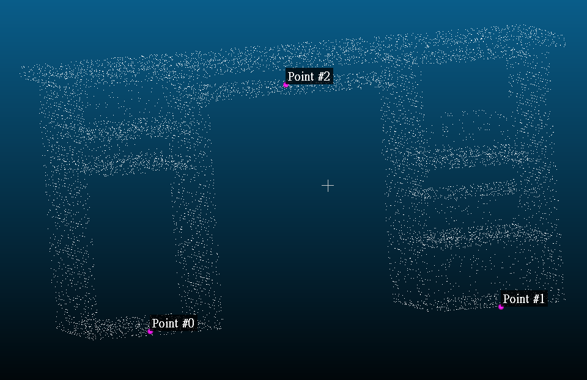
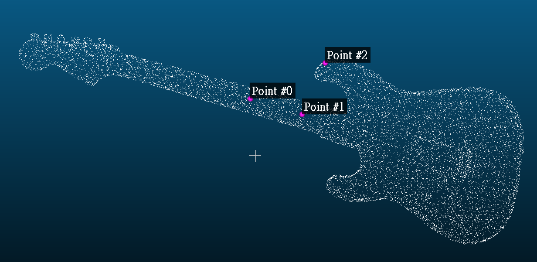

# HW8

# SPFH

每个点的特征是一个长度为33的向量，用`spfh`这个矩阵来储存。

```python
spfh = np.empty((len(point_cloud_o3d.points), 33))
```

对每一个点对，计算`u`,`v`,`w`再计算`alpha`,`phi`,`theta`。

```python
u = point_cloud_o3d.normals[i1]
v = np.cross(u, (p2-p1)/d)
w = np.cross(u, v)

d = LA.norm(p2-p1)
alphas.append(np.dot(v, n2))
phis.append(np.dot(u, (p2-p1)/d))
thetas.append(np.arctan2(np.dot(n2, w), np.dot(n2, u)))
```

最后对`alphas`,`phis`,`thetas`分别做binning，串成一个长度为33的向量。

```python
spfh[i1] = binning3(alphas, phis, thetas)
```

以下为`binning3`函数的定义：

```python
def binning_cos(a):
    # cosine value's range: [-1, 1]
    hist, _ = np.histogram(a, bins=11, range=[-1,1])
    return hist

def binning_arctan(a):
    # arctan value's range: [-PI, PI]
    hist, _ = np.histogram(a, bins=11, range=[-np.pi,np.pi])
    return hist

def binning3(alphas, phis, thetas):
    # binning and then concat
    return np.concatenate([binning_cos(alphas),
                           binning_cos(phis),
                           binning_arctan(thetas)])
```

直接调用`np.histogram`函数，但有一点要注意的是`alphas`及`phis`的范围是`[-1,1]`，`thetas`的范围是`[-PI,PI]`。

# FPFH

FPFH由SPFH做weighted sum而来，因此每个点的特征也是一个长度为33的向量，用`fpfh`这个矩阵来储存。

```python
fpfh = np.empty((len(point_cloud_o3d.points), 33))
```

每个点的FPFH由以下公式给出：



代码如下：

```python
fpfh[i1] = spfh[i1]
k = len(neighbors_dict[i1])
for i2 in neighbors_dict[i1]:
    p2 = point_cloud_o3d.points[i2]
    # weight of i2 is 1/LA.norm(p1-p2)
    fpfh[i1] += spfh[i2] / LA.norm(p1-p2) / k
```

# SHOT

SHOT特征是将32个volume的长度为11的histogram串起来得到的，因此每个点的特征是一个长度为352的向量，用`shot`这个矩阵来储存。

```python
shot = np.zeros((len(point_cloud_o3d.points), 352))
```

SHOT比较复杂，对每一个点，要先建立LRF，然后把以该点为中心的球体切成32个volume，再计算每个volume的`cos(theta)`的histogram。

## 建立LRF

计算weighted covariance matrix within radius R

```python
denom = 0
M = np.zeros((3, 3))
for i2 in neighbors_dict[i1]:
    p2 = point_cloud_o3d.points[i2]
    denom += (R - LA.norm(p1-p2))
    M += (R - LA.norm(p1-p2)) * np.outer(p2-p1, (p2-p1).T)
M /= denom
```

将三个eigenvector由大到小排序，记为`x_pos`,`y_pos`,`z_pos`：

```python
u, s, vh = np.linalg.svd(M, full_matrices=True)
eigenvalues = s
eigenvectors = u
order = eigenvalues.argsort()[::-1]
eigenvalues = eigenvalues[order]
eigenvectors = eigenvectors[:, order]

x_pos, y_pos, z_pos = eigenvectors
```

计算`Sx_pos`及`Sz_pos`，分别为在正x轴所在的half space的点的数量和在正z轴所在的half space的点的数量：

```python
Sx_pos, Sz_pos = 0, 0

for i2 in neighbors_dict[i1]:
    p2 = point_cloud_o3d.points[i2]
    if np.dot(p2-p1, x_pos) >= 0:
        Sx_pos += 1
    if np.dot(p2-p1, z_pos) >= 0:
        Sz_pos += 1
```

将`x`和`z`设为拥有较多点的那个方向，然后做外积得到`y`。

```python
x = x_pos * pow(-1, Sx_pos < len(neighbors_dict)/2)
z = z_pos * pow(-1, Sz_pos < len(neighbors_dict)/2)
y = np.cross(z, x)

# normalize the  axis!
x = x / LA.norm(x)
y = y / LA.norm(y)
z = z / LA.norm(z)
```

## 将球体切成32个volume

`azi`：在经度方向切成8段。先计算`p2`投影到LRF里XY平面后与x轴的角度，然后再除以`2 * np.pi/8`来决定它属于哪个bin。

`ela`：在纬度方向切成2段，即北半球和南半球。

`rad`：在径向切成2段，即内圈和外圈。

`volumes`是一个key为`(azi,ela,rad)`，value为list of index的dict。

```python
volumes = defaultdict(lambda : [])
for i2 in neighbors_dict[i1]:
    p2 = point_cloud_o3d.points[i2]
    d = LA.norm(p2-p1)
    azi = np.arccos(np.dot(x, (p2-p1)/d)) #np.arccos: [0, pi]
    # check y coordinate
    if p2[1] < p1[1]: azi = 2 * np.pi - azi
    azi = math.floor(azi/(2 * np.pi/8))
    # compare z coordinate, if less, ela will be 0, o.w. it's 1
    ela = int(p2[2] >= p1[2])
    # compare distance with R/2, if less rad will be 0, o.w. it's 1
    rad = int(d >= R/2)
    volumes[(azi, ela, rad)].append(i2)
```

## 计算每个volume的histogram

```python
for idx, (azi, ela, rad) in enumerate(itertools.product(range(0, 8),
    [0, 1], [0, 1])):
    cosines = []
    for i2 in volumes[(azi, ela, rad)]:
        cosines.append(
            np.dot(n1, point_cloud_o3d.normals[i2]))
    
    hist, _ = np.histogram(cosines, bins=11, range=(-1,1))
    shot[i1][idx*11:(idx+1)*11] = hist
shot[i1] /= LA.norm(shot[i1])
```

计算完每个volume的histogram后，填到`shot`矩阵里相应的位置。填完后做normalize。

# SOFT SHOT

建立LRF的部分与SHOT一致。

## 将球体切成352个bins

```python
azi_res = 2*np.pi/8
ela_res = np.pi/2
rad_res = R/2
cosine_res = 2/11

azi_bins = np.arange(0, 2*np.pi, azi_res)
ela_bins = np.arange(-np.pi/2, np.pi/2, ela_res)
rad_bins = np.arange(0, R, rad_res)
cosine_bins = np.arange(-1, 1, cosine_res)

bins = np.zeros((8,3,3,12)) #np.zeros((8,2,2,11))
```

这里`bins`的大小本应为`(8,2,2,11)`，但是为了要处理后面“越界”的问题，才在elevation,radiance,cosine三个维度加上dummy bins。

## 做soft voting

对`p1`的每个邻居`p2`，计算其在LRF里的经度，纬度，离球心距离及两者法向量的内积，即`azi`,`ela`,`rad`及`cosine`。

```python
p2 = point_cloud_o3d.points[i2]
n2 = point_cloud_o3d.normals[i2]
d = LA.norm(p2-p1)
azi = np.arccos(np.dot(x, (p2-p1)/d)) #np.arccos: [0, pi]
# check y coordinate
if p2[1] < p1[1]: azi = 2 * np.pi - azi
ela = np.arccos(np.dot(z, (p2-p1)/d))-np.pi/2
rad = d
cosine = np.dot(n1, n2)
```

然后找出`p2`所在位置在4个维度前后两个bin的index。

```python
azi_idx_hi = bisect.bisect_right(azi_bins, azi)
ela_idx_hi = bisect.bisect_right(ela_bins, ela)
rad_idx_hi = bisect.bisect_right(rad_bins, rad)
cosine_idx_hi = bisect.bisect_right(cosine_bins, cosine)

azi_idx_lo = azi_idx_hi - 1
ela_idx_lo = ela_idx_hi - 1
rad_idx_lo = rad_idx_hi - 1
cosine_idx_lo = cosine_idx_hi - 1
```

如果点落在最后一个bin里，就无法往后面的bin投票，因此`xxx_idx_hi`就作废了（这里的实现方式是让它投票到dummy bin里）。

但是在经度这个维度上，我们可以将最后一个bin的后一个bin想成是第0个bin（绕回来），所以有：

```python
if azi_idx_hi == len(azi_bins): azi_idx_hi = 0
```

然后对它周遭的32个bin做soft voting：

```python
bins[azi_idx_lo][ela_idx_lo][rad_idx_lo][cosine_idx_lo] += \
    azi_w_lo * ela_w_lo * rad_w_lo * cosine_w_lo
bins[azi_idx_lo][ela_idx_lo][rad_idx_lo][cosine_idx_hi] += \
    azi_w_lo * ela_w_lo * rad_w_lo * cosine_w_hi
bins[azi_idx_lo][ela_idx_lo][rad_idx_hi][cosine_idx_lo] += \
    azi_w_lo * ela_w_lo * rad_w_hi * cosine_w_lo
bins[azi_idx_lo][ela_idx_lo][rad_idx_hi][cosine_idx_hi] += \
    azi_w_lo * ela_w_lo * rad_w_hi * cosine_w_hi
bins[azi_idx_lo][ela_idx_hi][rad_idx_lo][cosine_idx_lo] += \
    azi_w_lo * ela_w_hi * rad_w_lo * cosine_w_lo
bins[azi_idx_lo][ela_idx_hi][rad_idx_lo][cosine_idx_hi] += \
    azi_w_lo * ela_w_hi * rad_w_lo * cosine_w_hi
bins[azi_idx_lo][ela_idx_hi][rad_idx_hi][cosine_idx_lo] += \
    azi_w_lo * ela_w_hi * rad_w_hi * cosine_w_lo
bins[azi_idx_lo][ela_idx_hi][rad_idx_hi][cosine_idx_hi] += \
    azi_w_lo * ela_w_hi * rad_w_hi * cosine_w_hi
bins[azi_idx_hi][ela_idx_lo][rad_idx_lo][cosine_idx_lo] += \
    azi_w_hi * ela_w_lo * rad_w_lo * cosine_w_lo
bins[azi_idx_hi][ela_idx_lo][rad_idx_lo][cosine_idx_hi] += \
    azi_w_hi * ela_w_lo * rad_w_lo * cosine_w_hi
bins[azi_idx_hi][ela_idx_lo][rad_idx_hi][cosine_idx_lo] += \
    azi_w_hi * ela_w_lo * rad_w_hi * cosine_w_lo
bins[azi_idx_hi][ela_idx_lo][rad_idx_hi][cosine_idx_hi] += \
    azi_w_hi * ela_w_lo * rad_w_hi * cosine_w_hi
bins[azi_idx_hi][ela_idx_hi][rad_idx_lo][cosine_idx_lo] += \
    azi_w_hi * ela_w_hi * rad_w_lo * cosine_w_lo
bins[azi_idx_hi][ela_idx_hi][rad_idx_lo][cosine_idx_hi] += \
    azi_w_hi * ela_w_hi * rad_w_lo * cosine_w_hi
bins[azi_idx_hi][ela_idx_hi][rad_idx_hi][cosine_idx_lo] += \
    azi_w_hi * ela_w_hi * rad_w_hi * cosine_w_lo
bins[azi_idx_hi][ela_idx_hi][rad_idx_hi][cosine_idx_hi] += \
    azi_w_hi * ela_w_hi * rad_w_hi * cosine_w_hi
```
最后将投票结果储存到`shot`这个矩阵里，然后做normalize。

```python
shot[i1] = bins[:,:2,:2,:11].flatten()
shot[i1] /= LA.norm(shot[i1])
```

# PCL FPFH

为了做测试，从C++调用PCL函数来计算FPFH。以下代码取自官网教学：

```cpp
pcl::PointCloud<pcl::FPFHSignature33>::Ptr calculate_fpfh(pcl::PointCloud<pcl::PointXYZ>::Ptr cloud, 
	pcl::PointCloud<pcl::Normal>::Ptr normals) {
	pcl::FPFHEstimation<pcl::PointXYZ, pcl::Normal, pcl::FPFHSignature33> fpfh;
	fpfh.setInputCloud(cloud);
	fpfh.setInputNormals(normals);
    
	pcl::search::KdTree<pcl::PointXYZ>::Ptr tree(new pcl::search::KdTree<pcl::PointXYZ>);

	fpfh.setSearchMethod(tree);
    
	pcl::PointCloud<pcl::FPFHSignature33>::Ptr fpfhs(new pcl::PointCloud<pcl::FPFHSignature33>());
	fpfh.setRadiusSearch(0.05);

	fpfh.compute(*fpfhs);

	return fpfhs;
}
```

# PCL SHOT

为了做测试，从C++调用PCL函数来计算SHOT。以下代码取自官网教学：

```cpp
pcl::PointCloud<pcl::SHOT352>::Ptr calculate_shot(pcl::PointCloud<pcl::PointXYZ>::Ptr cloud,
	pcl::PointCloud<pcl::Normal>::Ptr normals) {
	pcl::SHOTEstimationOMP<pcl::PointXYZ, pcl::Normal, pcl::SHOT352> descr_est;
	pcl::PointCloud<pcl::SHOT352>::Ptr cloud_descriptors(new pcl::PointCloud<pcl::SHOT352>());

	float descr_rad_(0.2f);

	descr_est.setRadiusSearch(descr_rad_);

	descr_est.setInputCloud(cloud);
	descr_est.setInputNormals(normals);
	descr_est.setSearchSurface(cloud);
	descr_est.compute(*cloud_descriptors);

	return cloud_descriptors;
}
```

# 测试

选取了4个点云做测试，每个点云挑选三个点，点一及点零相像，点二与点零不像。然后计算它们的特征的cosine similarity。









## self-implemented

SPFH及FPFH的半径取0.03，SHOT的半径取0.07。

点零和点一的cosine similarity（应该要很高）：

Testcase|SPFH|FPFH|SHOT|SOFT SHOT
---|---|---|---|---
airplane_0001|0.63415| 0.85717 |0.0|-0.06610
bottle_0012|0.79471|0.96995|0.10607|0.18508
desk_0045| 0.97332 |0.98076|0.15119|-0.07415
guitar_0010|0.90924|0.99333|0.09668|0.16734         

点零和点二的cosine similarity（应该要很低）：

Testcase|SPFH|FPFH|SHOT|SOFT SHOT
---|---|---|--- |---
airplane_0001| 0.67759  | 0.58464 | 0.08969 | -0.08305 
bottle_0012|0.53530|0.52399|0.01865| 0.21638 
desk_0045| 0.30316 |0.85471|0.12535| 0.00027 
guitar_0010|0.70519|0.88747|0.23970 | 0.08091 


其中SHOT及SOFT SHOT表现极差，不确定是什么问题。

## PCL

SPFH及FPFH的半径取0.03，SHOT的半径取0.07。

点零和点一的cosine similarity（应该要很高）：


Testcase|PCL FPFH|PCL SHOT
---|---|---
airplane_0001|0.7609051060707168|0.5403870040289458
bottle_0012|0.9498945259153373|0.878174620254379
desk_0045|0.9715804239353945|0.6381363923946404
guitar_0010|0.9848195253123145|0.6163233343586609

点零和点二的cosine similarity（应该要很低）：

| Testcase      | PCL FPFH            | PCL SHOT            |
| ------------- | ------------------- | ------------------- |
| airplane_0001 | 0.518466580185878   | 0.07609375415551642 |
| bottle_0012   | 0.47358386631464516 | 0.06697481868181188 |
| desk_0045     | 0.8727638668146742  | 0.24844515525691246 |
| guitar_0010   | 0.8561022147992973  | 0.17858914741031906 |

结果十分合理。

