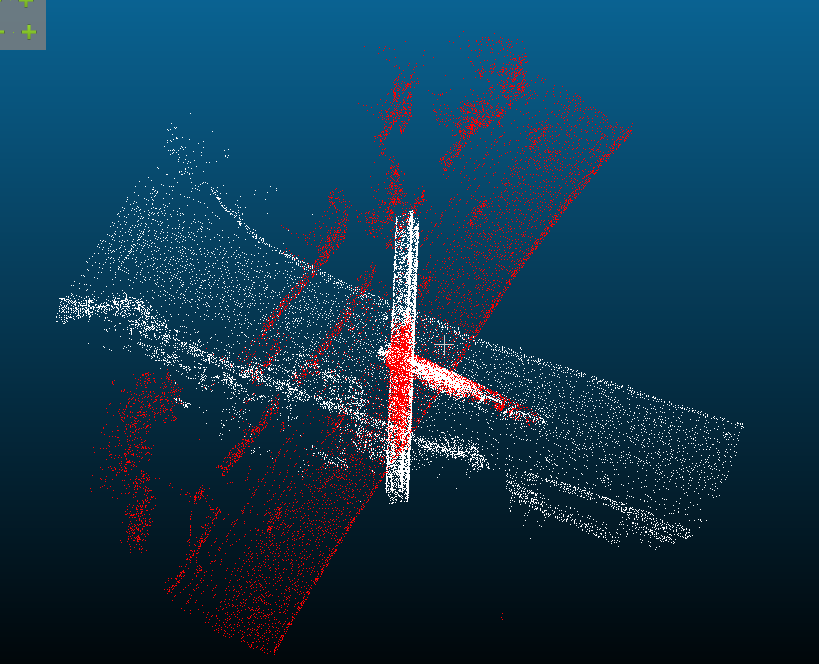
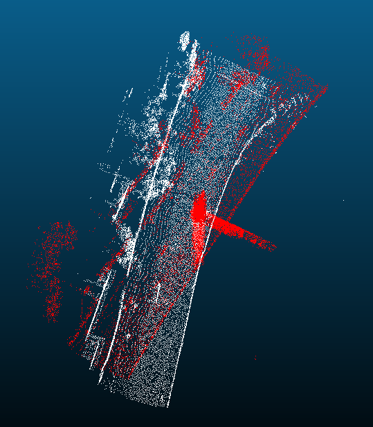
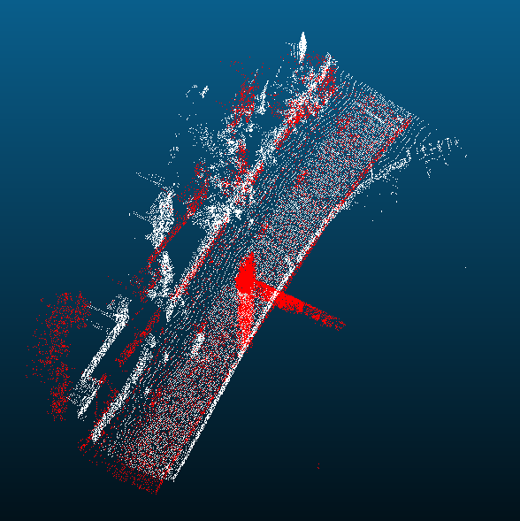
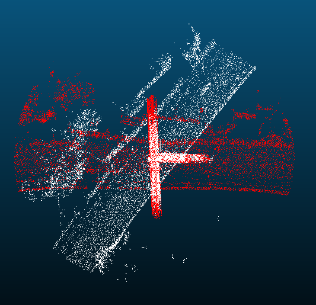
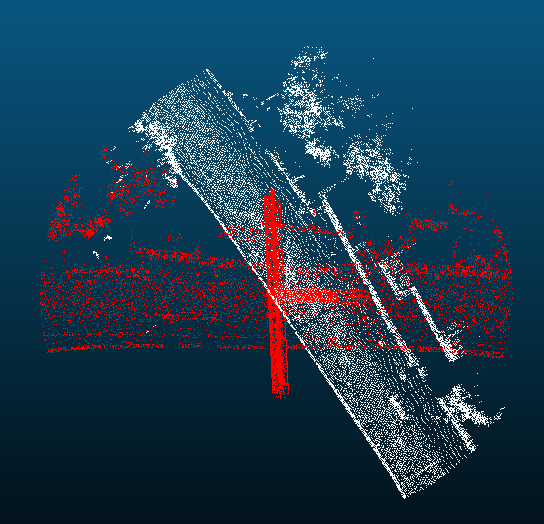
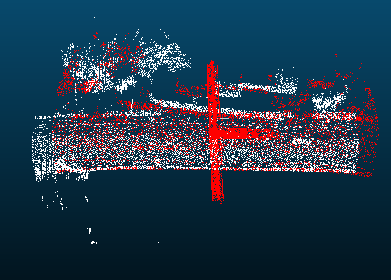
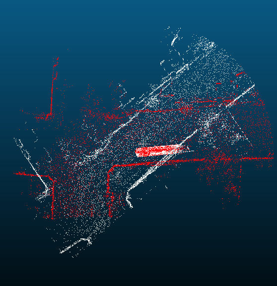
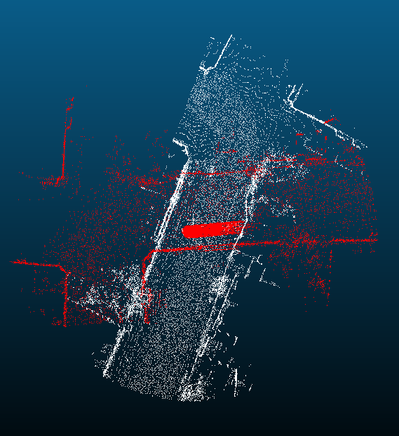
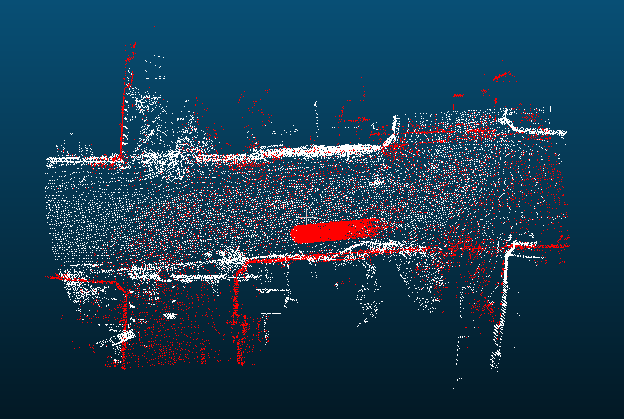

# HW9

## 初始解

ICP只有在两个点云的pose差距不大时才管用，因此它需要一个好的初始解。

启发自SHOT的LRF，对source点云及target点云建立各自的reference frame：

```python
def lrf_builder(point_cloud_o3d, neighbors_indices, R, center):
    """
    build LRF
    """
    denom = 0
    M = np.zeros((3, 3))
    for i2 in neighbors_indices:
        p2 = point_cloud_o3d.points[i2]
        denom += (R - LA.norm(center-p2))
        M += (R - LA.norm(center-p2)) * np.outer(p2-center, (p2-center).T)
    assert denom != 0, "neighbor cnt: {}, denom: {}".format(
        len(neighbors_indices), denom)
    M /= denom
    u, s, vh = np.linalg.svd(M, full_matrices=True)
    eigenvalues = s
    eigenvectors = u
    order = eigenvalues.argsort()[::-1]
    eigenvalues = eigenvalues[order]
    eigenvectors = eigenvectors[:, order]
    
    x_pos, y_pos, z_pos = eigenvectors
    Sx_pos, Sz_pos = 0, 0
    
    for i2 in neighbors_indices:
        p2 = point_cloud_o3d.points[i2]
        if np.dot(p2-center, x_pos) >= 0:
            Sx_pos += 1
        if np.dot(p2-center, z_pos) >= 0:
            Sz_pos += 1
    
    # if there are more points whose x >= 0, then x will be x_pos
    x = x_pos * pow(-1, Sx_pos < len(neighbors_indices)/2)
    z = z_pos * pow(-1, Sz_pos < len(neighbors_indices)/2)
    y = np.cross(z, x)
    
    # normalize the  axis!
    x = x / LA.norm(x)
    y = y / LA.norm(y)
    z = z / LA.norm(z)
    
    return np.array([x, y, z])
```

然后将source点云旋转到target点云的坐标系上：

```python
#...
src_coord = lrf_builder(src_cloud, src_neighbors_indices, src_R, src_center)
#...
tgt_coord = lrf_builder(tgt_cloud, tgt_neighbors_indices, tgt_R, tgt_center)

R = np.matmul(tgt_coord, LA.inv(src_coord))
t = (tgt_center - src_center)[...,np.newaxis]
src_points = np.asarray(src_cloud.points).T
src_points = np.asarray(np.matmul(R, src_points) + t)
```

## 特征点提取

用ISS对src及dst点云做特征点提取。

```python
use_fea_detect = False
if use_fea_detect:
    #...
    src_idxs = iss(src_cloud, src_tree, 
                             srm, nmrm, gamma_21, gamma_32)
    
    tgt_idxs = iss(tgt_cloud, tgt_tree, 
                             srm, nmrm, gamma_21, gamma_32)
```

之后只对特征点做校正。

## 特征点描述

使用FPFH描述特征点：

```python
use_fea_descript = False
fea_descript_thres = 0
if use_fea_descript:
    r = 0.03
    src_fea = fpfh_calculator(src_cloud, radius = r)
    tgt_fea = fpfh_calculator(tgt_cloud, radius = r)
```

在进行ICP的data association时，如果两个点的FPFH的内积小于`fea_descript_thres`，则不进行匹配：

```python
if use_fea_descript:
    if np.dot(src_fea[src_i], tgt_fea[tgt_i]) < fea_descript_thres: 
        continue
```

## 求解旋转矩阵及平移向量

### Point-to-Point

```python
u, s, vh = np.linalg.svd(
    np.matmul(tgt_norm_cloud, src_norm_cloud.T),
    full_matrices=True)

R = np.matmul(u, vh)
t = tgt_center - np.matmul(R, src_center)
```

### Point-to-Plane

```python
tgt_normals = np.asarray(tgt_cloud.normals)
ax1 = (tgt_normals[:,2]*src_points[1,:] - tgt_normals[:,1]*src_points[2,:])[...,np.newaxis]
ax2 = (tgt_normals[:,0]*src_points[2,:] - tgt_normals[:,2]*src_points[0,:])[...,np.newaxis]
ax3 = (tgt_normals[:,1]*src_points[0,:] - tgt_normals[:,0]*src_points[1,:])[...,np.newaxis]
A = np.hstack([ax1, ax2, ax3, tgt_normals])
b = np.einsum('ij,ij->i', tgt_normals, (tgt_points - src_points).T)
x = np.matmul(
        np.matmul(
            LA.inv(np.matmul(A.T,A)), 
            A.T), 
        b)
alpha, beta, gamma, tx, ty, tz = x
R = np.array([
    [1, -gamma, beta],
    [gamma, 1, -alpha],
    [-beta, alpha, 1]])

t = np.array([tx, ty, tz])[...,np.newaxis]
```

## 由homogeneous transform matrix获得quaternion

参考自[Maths - Conversion Matrix to Quaternion](https://www.euclideanspace.com/maths/geometry/rotations/conversions/matrixToQuaternion/)：

```python
def copysign(v, s):
    # copy the sign of s to v
    if v * s < 0:
        v *= -1
    return v
    
def rotmat2quaternion(m):
    trace = m[0][0]+m[1][1]+m[2][2]
    qw = np.sqrt(max(0, trace+1))/2
    qx = np.sqrt(max(0, 1+m[0][0]-m[1][1]-m[2][2]))/2
    qy = np.sqrt(max(0, 1-m[0][0]+m[1][1]-m[2][2]))/2
    qz = np.sqrt(max(0, 1-m[0][0]-m[1][1]+m[2][2]))/2
    qx = copysign(qx, m[2][1]-m[1][2])
    qy = copysign(qy, m[0][2]-m[2][0])
    qz = copysign(qz, m[1][0]-m[0][1])
    return qw, qx, qy, qz
```

# 结果

以下的结果是关闭特征点提取及描述，使用Point-to-Point作为cost function所跑出来的结果。

`evaluate_rt.py`里有这两句：

```python
dst_trans_np = np.dot(rot.as_matrix(), dst_np) + np.expand_dims(t, 1)
visualize_pc_pair(src_np, dst_trans_np)
```

看起来是将dst点云对齐到src点云。

所以我在我的主程序里读取`reg_result.csv`时，会将`src_idx`及`tgt_idx`的顺序调换：

```python
for i, (tgt_idx, src_idx) in enumerate(pairs):
    # ...
```

`evaluate_rt.py`的输出（只提供三个ground truth，所以successful rate极低）：

```
['0', '456', '1.316969', '1.008768', '-0.070692', '0.553488', '-0.0018', '0.006972', '-0.832826']
['645', '189', '-0.729231', '3.926141', '-0.161368', '0.763468', '0.002676', '0.010401', '0.645757']
['691', '503', '0.212241', '-0.262442', '-0.08639', '0.999898', '0.000911', '-0.002854', '0.013986']
Registration successful rate: 0.01, successful counter: 3, 
average Relative Translation Error (RTE): 0.54, average Relative Rotation Error (RRE): 1.59
```

以下是一些实验结果：

<p float="left">
  
   
  
</p>


上面是193及8这一对。红色为target，白色为source。三张图分别为对齐前，初始解及ICP迭代290次之后的结果。

<p float="left">
  
   
  
</p>


上面是196及176这一对。可能是横向的outlier跨度太大，所以使用LRF求得的初始解效果不好。

<p float="left">
  
   
  
</p>


上面是409及783这一对，ICP似乎将409的头对到783的尾了。
